# MiniCloud 分布式 WASM 函数平台需求规格说明书

| 字段 | 内容 |
| --- | --- |
| 文档版本 | 1.0 |
| 文档状态 | 已定版（需求基线） |
| 日期 | 2026-07-11 |
| 目标版本 | MiniCloud v1.0 |
| 实现语言 | Go |
| 主要读者 | 产品设计者、架构师、开发者、测试者、项目评审者 |

## 1. 文档约定

本文中的关键词具有以下含义：

- **必须（MUST）**：v1.0 验收不可缺少的要求。
- **应该（SHOULD）**：默认需要实现；只有记录充分理由后才可推迟。
- **可以（MAY）**：增强能力，不影响 v1.0 核心验收。
- **P0**：Core Gate；缺失时平台主流程不可成立，全部通过后形成可独立演示的 `v0.1-core`。
- **P1**：Showcase Gate；建立在 P0 闭环之上，全部通过后才达到本 Spec 的最终 `v1.0` 完成标准。
- **P2**：后续扩展，不作为 v1.0 发布门槛。

除非特别标记，本文所有带编号的 P0 和 P1 要求均属于 v1.0 范围。

## 2. 项目摘要

MiniCloud 是一个使用 Go 实现的分布式 WASM 函数计算平台。用户能够上传由 Go 等语言编译的 WASM/WASI 模块，将其发布为不可变函数版本，并通过 HTTP、定时任务或异步事件调用。

平台由 Raft 控制面、函数网关、调度器、Worker、WASM 运行时、制品存储和异步任务存储组成。Raft 仅保证低频控制面元数据的一致性；函数制品、调用载荷、日志和高频调用状态不进入 Raft 日志。

MiniCloud 的主要价值不是替代公有云 FaaS，而是通过一个可运行、可故障演示、可测量的系统呈现以下技术能力：

- 分布式一致性与故障恢复；
- 期望状态与实际状态的协调；
- WASM 沙箱与能力权限；
- 函数版本、灰度发布和快速回滚；
- Scale to Zero、冷启动和预热；
- 同步、异步和事件驱动调用；
- 可观测性与可重复的故障注入。

## 3. 目标与非目标

### 3.1 产品目标

| ID | 优先级 | 目标 |
| --- | --- | --- |
| GOAL-001 | P0 | 在本地或多主机环境运行至少 3 个控制节点和 2 个 Worker 进程，形成真实网络通信的集群。 |
| GOAL-002 | P0 | 用户能够发布 Go 编译的 WASM 函数，并通过 HTTP 同步调用。 |
| GOAL-003 | P0 | 任意 1 个控制节点故障后，已提交控制状态不丢失，集群能够重新选主。 |
| GOAL-004 | P0 | Worker 故障后，Controller 能够发现实际状态偏差并恢复期望副本。 |
| GOAL-005 | P0 | 不可信函数受到明确的时间、内存、输入输出和 Capability 限制。 |
| GOAL-006 | P1 | 支持不可变版本、权重灰度、稳定分流和原子回滚。 |
| GOAL-007 | P1 | 支持 Scale to Zero、按需激活和编译缓存预热。 |
| GOAL-008 | P1 | 支持异步调用、Cron 和通用事件触发。 |
| GOAL-009 | P1 | 提供可观测性和受保护的 Chaos 能力，能够复现并解释故障行为。 |
| GOAL-010 | P1 | 提供清晰、一致、可脚本化的 HTTP API 与 CLI。 |

### 3.2 非目标

以下内容不属于 v1.0：

| ID | 非目标 | 原因 |
| --- | --- | --- |
| NOGOAL-001 | 多地域共识与跨地域容灾 | 显著扩大一致性和网络模型范围。 |
| NOGOAL-002 | 完整 Kubernetes API 或调度兼容 | MiniCloud 不是 Kubernetes 的重新实现。 |
| NOGOAL-003 | 任意 OCI 容器执行 | v1.0 专注 WASM/WASI。 |
| NOGOAL-004 | 自研完整对象存储、数据库或消息队列产品 | 只实现满足本地参考部署的最小持久层及抽象。 |
| NOGOAL-005 | 公有云级计费、账单和商业 SLA | 不属于学习与作品集目标。 |
| NOGOAL-006 | 严格 exactly-once 函数执行 | 分布式故障下不作不可证明的保证。 |
| NOGOAL-007 | 完整多租户 IAM 与硬件级隔离 | v1.0 为单管理域，但保留命名空间和身份字段。 |
| NOGOAL-008 | 任意语言 SDK 的完整生态 | v1.0 以 Go 为第一支持语言。 |
| NOGOAL-009 | 流式请求、WebSocket 和长连接函数 | v1.0 使用有界请求/响应模型。 |
| NOGOAL-010 | 服务端源码构建 | v1.0 只接收已构建 WASM，避免引入独立 Builder Sandbox 攻击面。 |
| NOGOAL-011 | 托管 Secret 服务 | v1.0 不接收或向 Guest 注入 Secret 明文。 |
| NOGOAL-012 | 严格 CPU/Fuel 配额 | v1.0 只有端到端墙钟 Deadline；硬 CPU 隔离属于进程/容器档位。 |

### 3.3 信任与威胁边界

v1.0 是单集群、单可信管理域。平台管理员、Controller 和 Worker 运维者被视为可信；函数模块、函数输入和外部调用者被视为不可信。Namespace 是组织字段，不是多租户安全边界。

进程内 WASM Runtime 必须防止 Guest 通过正常 WASM/WASI 接口读取未授权宿主资源，并限制 Guest 的线性内存、墙钟时间、输入输出和并发。然而，v1.0 **不承诺**抵御 Runtime 本身的漏洞、旁路攻击、宿主内核漏洞或敌对租户之间的生产级强隔离。线性内存上限不等于 Worker RSS 上限，墙钟 Deadline 也不等于精确 CPU 配额。

如未来要求运行互不信任租户提交的敌对代码，必须新增独立进程或容器边界、非 Root 用户、操作系统 CPU/Memory/Pids 配额、只读文件系统和系统调用限制，并重新完成威胁建模；该能力属于 P2。

## 4. 发布范围与部署档位

### 4.1 v1.0 发布门槛

`v0.1-core` 必须先独立通过全部 P0，不能依赖尚未完成的 P1 才能发布和调用函数。最终 v1.0 必须再完成全部 P1。P2 可以保留接口和设计空间，但不得以空实现、未受保护的开关或误导性 API 暗示已经支持。

### 4.2 Local Profile

Local Profile 是 v1.0 的权威演示与验收环境：

- 同一台机器上运行 3 个独立 Controller 进程；
- 运行至少 2 个独立 Worker 进程；
- 运行 1 个 Gateway 进程；
- 使用本地磁盘的内容寻址制品存储；
- 使用成熟的耐久队列服务保存异步任务；参考实现默认采用 NATS JetStream 单节点开发档位，并将数据持久化到本地磁盘；
- 节点通过真实 TCP 端口通信，不得以单进程对象模拟替代端到端验收；
- Linux、macOS 和 Windows 至少应能运行开发档位；发布验收以项目记录的参考平台为准。

Local Profile 允许制品服务和异步队列服务为单实例，因此它们的高可用不是 v1.0 保证。Raft 高可用不代表 Artifact 或 Async Queue 高可用；该限制必须写入运行文档和状态接口。

### 4.3 Cluster Profile

Cluster Profile 用于多主机演示：

- Controller 分布在 3 个故障域；
- Worker 可横向加入或退出；
- Gateway 为无状态进程，P1 验收至少运行 2 个 Gateway 验证 Route/Endpoint 原子传播；
- 节点间通信支持 TLS；节点 mTLS 身份属于 P2 安全硬化目标；
- 制品和异步任务后端可替换为外部高可用实现；
- v1.0 必须保证协议和存储抽象可替换，但不强制交付外部后端适配器。

## 5. 用户角色与核心用户故事

### 5.1 用户角色

| 角色 | 职责 |
| --- | --- |
| 函数开发者 | 编写、构建、发布、调用和排查函数。 |
| 平台管理员 | 管理节点、路由、配额、权限、升级和故障演练。 |
| 系统评审者 | 检查一致性保证、故障行为、性能数据和实现边界。 |

### 5.2 核心用户故事

| ID | 用户故事 | 优先级 |
| --- | --- | --- |
| US-001 | 作为函数开发者，我可以上传 Go 编译的 WASM 模块并获得不可变版本。 | P0 |
| US-002 | 作为函数开发者，我可以通过稳定 URL 同步调用当前已发布版本。 | P0 |
| US-003 | 作为函数开发者，我可以查看每次调用的请求 ID、版本、Worker、耗时和结果状态。 | P0 |
| US-004 | 作为函数开发者，我可以异步提交任务并查询或取消；失败任务按策略自动重试。 | P1 |
| US-005 | 作为函数开发者，我可以配置 Cron 或事件触发器。 | P1 |
| US-006 | 作为平台管理员，我可以按权重发布新版本并原子回滚。 | P1 |
| US-007 | 作为平台管理员，我可以设置副本上下限、空闲缩容时间和资源限制。 | P1 |
| US-008 | 作为平台管理员，我可以使 Worker 排空并安全退出。 | P0 |
| US-009 | 作为平台管理员，我可以观察 Raft、调度、运行时和调用指标。 | P0 |
| US-010 | 作为平台管理员，我可以在开发模式下注入 Leader、Worker 和网络故障。 | P1 |
| US-011 | 作为评审者，我可以通过脚本重复运行故障和性能验收，而非依赖人工演示。 | P1 |

## 6. 术语

| 术语 | 定义 |
| --- | --- |
| Function | 用户可调用的逻辑名称，例如 `resize-image`。 |
| Version | 与一个制品摘要和不可变配置绑定的函数版本。 |
| Artifact | WASM 二进制及其清单，以内容摘要寻址。 |
| Route | Function 到一个或多个 Version 的权重映射。 |
| Deployment | 某个 Version 的期望副本、限制和调度状态。 |
| Replica | 一个调度到 Worker 的可服务单元，持有 Version、策略、Artifact/Compiled Module 准备状态和有界调用槽；它不是可跨调用复用的 Guest。 |
| Guest Instance | 为一次 Invocation 创建的临时 WASM Module Instance，调用结束后销毁。 |
| Compiled Module | Worker 已验证并编译、可供多个全新 Guest Instance 使用的只读缓存对象。 |
| Warm | 目标 Worker 上已有 Ready Replica、Artifact 与 Compiled Module；仍然为本次调用创建全新 Guest Instance。 |
| Fetch-cold | Worker 本地没有 Artifact，需要下载、校验，再继续编译/实例化。 |
| Compile-cold | Artifact 已在本地，但没有匹配 Cache Key 的 Compiled Module。 |
| Warm-instantiate | Compiled Module 命中，但仍为本次调用创建全新 Guest Instance。 |
| Invocation | 一次同步或异步函数调用。 |
| Trigger | 将 HTTP、Cron 或 Event 转换为 Invocation 的配置。 |
| ServingSnapshot | Gateway 按 Function 原子应用的完整服务视图，包含 Function 状态、默认 HTTP Trigger 认证、Route 和 Ready Endpoint。 |
| Desired State | 经 Raft 提交、Controller 希望集群达到的状态。 |
| Actual State | Worker 心跳和运行状态反映的当前状态。 |
| Reconcile | 比较期望状态与实际状态并执行收敛动作。 |
| Capability | 函数被明确授予的 Host API、环境、文件或网络权限。 |
| Serving Authorization | Leader 在确认多数派后为具体 Assignment 签发/刷新的短期服务许可，绑定 Worker Session、Assignment ID、Version Admission Epoch、Deployment Generation、Policy Digest、Mode 和 Discovery Epoch；只用于限制新调用，不进入 Raft。 |
| Control Plane | 管理函数、版本、路由、部署和成员关系的强一致部分。 |
| Data Plane | 处理调用、制品获取、执行和结果传输的高频部分。 |

## 7. 架构原则与已决策事项

| ID | 决策 | 说明 |
| --- | --- | --- |
| DEC-001 | 控制面与数据面分离 | 每次调用不得写入或同步经过 Raft。 |
| DEC-002 | 使用成熟 Raft 实现 | 成熟库负责共识状态转换；平台只实现该库明确要求的存储/传输适配、业务状态机、Reconcile 和成员运维，不自创 Raft 协议或宣称自研共识。 |
| DEC-003 | Raft 只存元数据 | WASM 制品、请求体、响应体、日志和任务载荷不进入 Raft。 |
| DEC-004 | 不可变版本 | 已 Ready 的版本不得原地修改；更新产生新版本。 |
| DEC-005 | v1 函数 ABI 采用 WASI Command | 一次实例化处理一次调用，通过标准输入和标准输出交换有界 JSON Envelope，优先兼容 Go 标准工具链。 |
| DEC-006 | Warm 的基线含义是编译缓存 | v1 不依赖可重入 Guest ABI；未来可增加 Reactor/Component ABI。 |
| DEC-007 | 同步和异步语义分离 | 同步默认一次尝试；异步为至少一次并提供幂等键。 |
| DEC-008 | 单管理域但保留 Namespace | v1 只有 `default` Namespace，API 和对象模型保留命名空间字段。 |
| DEC-009 | 状态可解释优先 | 所有自动调度、缩放和重试必须暴露原因、时间和状态转换。 |
| DEC-010 | 故障能力默认关闭 | Chaos 只在显式开发开关及管理员鉴权下启用。 |
| DEC-011 | 有界可用性优先但不承诺严格单活 | 控制面短暂故障时，旧 Worker 在 Serving Authorization 内继续 Ready Replica；新 Leader 通过更高 Discovery Epoch、Worker Session 和唯一 Assignment ID 收敛，只有策略变更才提高 Deployment Generation，允许最长受 TTL 限制的副本重叠。 |
| DEC-012 | 异步数据面使用成熟耐久队列 | Trigger 配置属于 Raft；Invocation、Cron Cursor、Fire Record、Event Dedup、载荷、租约和结果属于独立队列/任务存储。参考 NATS JetStream 适配以持久事件流为权威、查询状态为可重建投影，并满足 ASY-013，不自研消息系统。 |
| DEC-013 | 兼容性由 ADR 锁定 | Go、TinyGo（如启用）、WASM Runtime、WASI Profile 和 Wasm Feature 版本必须锁定；升级必须执行完整 ABI、安全和缓存兼容套件。 |

## 8. 系统架构

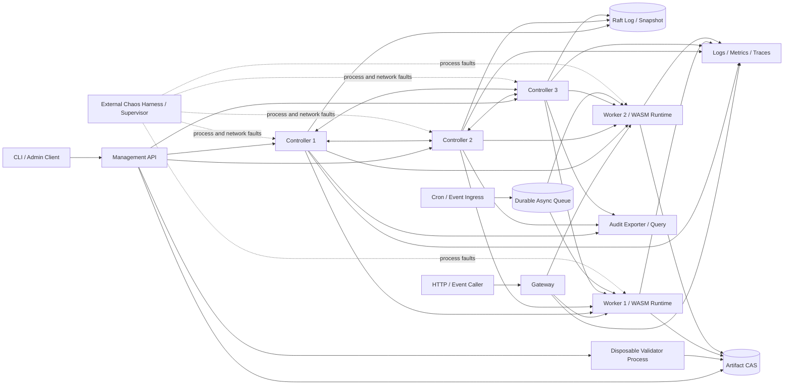

### 8.1 组件职责

| 组件 | 必须承担 | 不得承担 |
| --- | --- | --- |
| Management API | 鉴权、校验、控制面命令、查询聚合 | 直接执行函数 |
| Raft Controller | 强一致元数据、Leader 任务、状态机应用 | 制品、日志或调用载荷存储 |
| Scheduler/Reconciler | 期望与实际状态收敛、放置决策、缩放 | 直接代理用户请求体 |
| Gateway | 路由、限流、背压、同步调用、请求追踪 | 将每次调用提交 Raft |
| Worker Agent | 心跳、制品缓存、运行时管理、调用执行 | 自行修改控制面期望状态 |
| WASM Runtime | 模块验证、实例化、Capability 和资源限制 | 绕过策略访问宿主资源 |
| Validator | 在独立子进程中解析并试编译未受信 Artifact，输出验证报告 | 在 Controller/Management 主进程中执行用户构建或 Compile |
| Artifact CAS | 制品上传、摘要校验、下载和回收 | 保存可变版本语义 |
| Async Queue | 持久任务、租约、重试、结果保留 | 声称 exactly-once |
| Trigger Service | Cron/Event 转换、去重键生成 | 绕过异步队列直接执行 |
| Observability/Audit | 指标、结构化日志、Trace、审计导出和查询 | 默认记录敏感请求正文，或在导出确认前删除控制审计 |

## 9. 核心数据模型

所有持久控制对象必须包含 `id`、`namespace`、`created_at`、`updated_at`、不可变的 `created_raft_index` 和单调递增的 `resource_revision`。时间以 UTC 存储并使用 RFC 3339 表示；`created_raft_index` 取创建 Command 的 Log Index，用于不受墙钟回拨影响的稳定分页，不替代 Resource Revision。

### 9.1 Function

| 字段 | 要求 |
| --- | --- |
| name | Namespace 内唯一；匹配 `[a-z][a-z0-9-]{0,62}`。 |
| description | 可选，最大 512 UTF-8 字节。 |
| active_route_revision | 当前生效路由修订号。 |
| labels | 最多 32 个；Key 匹配 `[a-z][a-z0-9_.-]{0,62}`，Value 最多 256 UTF-8 字节。 |
| lifecycle | `Active`、`Disabled`、`Deleting` 或 `Tombstoned`。 |

### 9.2 Version

| 字段 | 要求 |
| --- | --- |
| function_id | 不可变父 Function ID。 |
| version_id | 服务端生成、函数内唯一且不可复用。 |
| artifact_digest | `sha256:<hex>` 内容摘要。 |
| manifest_digest | 使用 JCS/RFC 8785 计算的 Canonical Manifest Digest。 |
| artifact_size | 已提交 Artifact 的字节数。 |
| abi | v1 为 `wasi-command-v1`。 |
| host_api_profile | v1.0 固定为 `none`（除 WASI Runtime Baseline）；未来自定义 Host API 使用新版本化 Profile。 |
| runtime_feature_profile | 准入时锁定的 Wasm Feature Allowlist Profile。 |
| toolchain_metadata | 上传者声明的 Toolchain 名称与版本；无签名 Provenance 时标记为 `unverified`。 |
| admission_epoch | 发布时初始化，Version 进入 `Deleting` 时递增；Invocation 固定记录其被接收时的 Epoch。Function/Route 禁用通过各自 Revision 传播，不改写 Version Epoch。 |
| resource_request | Manifest 中不可变的超时、内存和并发请求。 |
| requested_capabilities | Manifest 中不可变的 Capability 申请，进入 Manifest Digest。 |
| state | `Uploaded`、`Validating`、`Ready`、`Failed`、`Deprecated`、`Deleting`、`Tombstoned`。 |
| validation_error | 失败时提供稳定错误码和安全摘要。 |

### 9.3 Route

| 字段 | 要求 |
| --- | --- |
| function_id | 不可变父 Function ID。 |
| route_revision | 每次原子 Route 修改递增。 |
| targets | `{version_id, admission_epoch, deployment_generation, effective_policy_digest, weight_basis_points}` 的完整映射。 |
| affinity_source | `request_id`、`idempotency_key` 或显式 Header。 |
| hash_version/salt_id | 版本化的稳定哈希算法、Salt 标识及 Raft 中不可变的 128-bit Salt；公开 API 只返回 Salt ID，内部 ServingSnapshot 携带计算所需 Salt。 |
| enabled | 可原子禁用入口。 |

### 9.4 Deployment

| 字段 | 要求 |
| --- | --- |
| version_id | 对应不可变 Version。 |
| generation | 执行资源、Capability、Runtime 或放置策略修改时递增，用于 Fence Assignment/Endpoint；单纯改变副本数量不得递增。 |
| scaling_revision | 伸缩模式、阈值或 `desired_replicas` 每次变化时递增，不参与 Worker 执行策略授权。 |
| resource_limits | 平台批准的固定资源档位与输入输出限制。 |
| granted_capabilities | 管理员允许的 Capability 集合。 |
| effective_policy_digest | Runtime 基线与有效授权的规范化摘要。 |
| min_replicas | 0..max_replicas。 |
| max_replicas | v1 默认上限 100。 |
| desired_replicas | Controller 计算并经状态机提交的目标。 |
| ready_replicas | 由实际状态汇总，不要求每次心跳写 Raft。 |
| target_concurrency | 每个 Ready Replica 的期望 Guest 并发。 |
| scaling_mode | `manual` 或 `auto`；Manual 使用显式副本，Auto 使用信号计算。 |
| idle_timeout | Scale to Zero 空闲窗口。 |
| desired_phase | Raft 中的 `Active`、`Draining`、`Stopped` 或 `Deleting`。 |
| conditions | 由 Actual State 派生的 `Progressing`、`Ready`、`Degraded`、`Failed`，带原因和 `observed_generation`。 |

每个 Deployment Generation 是不可变的执行资源、授权和放置策略快照。更新这些策略必须创建新 Generation，不能覆盖旧 Generation；新 Generation 只有在显式 Route Revision 引用后才接收新同步流量。Version 可以在过渡期同时保留多个 Generation，Reconciler 分别维护其 Desired/Actual。`desired_replicas` 和 `scaling_revision` 是某一 Generation 内的伸缩状态，不改变其执行策略身份。

旧 Generation 在当前 Route、任何 `rollback_eligible=true` 或 Pinned Route Revision、ServingSnapshot LKG、Assignment、非终态异步 Invocation 或删除排空记录仍引用时不得回收。未 Pin Route 历史过期或因依赖显式删除而失去回滚资格，且所有运行/异步引用消失后，Controller 才可提交确定性的 Generation GC 命令。

### 9.5 Worker

| 字段 | 要求 |
| --- | --- |
| worker_id | 稳定节点标识。 |
| boot_id | 每次进程启动生成，用于隔离陈旧会话。 |
| max_session_epoch | Worker Registry 中经 Raft 提交的会话高水位。 |
| session_epoch | Controller 在接受注册/重连前提交的递增会话代次。 |
| schedulable_intent | 经 Raft 提交的 `Schedulable`、`Draining` 或 `Removed`。 |
| labels | 架构、区域及管理员标签。 |
| capacity | 可分配内存、调用槽和缓存容量。 |
| allocated | 当前承诺资源。 |
| session_state | 当前 Leader 根据会话 Observation 派生的 `Joining`、`Ready`、`Suspect` 或 `Unavailable`。 |
| drain_state | 根据控制意图和实际调用派生的 `NotDraining`、`Draining` 或 `Drained`。 |
| last_heartbeat | Leader 维护的短期实际状态。 |

### 9.6 Assignment

| 字段 | 要求 |
| --- | --- |
| assignment_id | 全局唯一且不可复用。 |
| deployment_generation | 对应期望部署代次；Worker 只接受不低于已见代次的命令。 |
| version/artifact | 不可变 Version ID、Artifact Digest。 |
| admission_epoch | Assignment 创建时绑定的 Version Admission Epoch。 |
| effective_policy_digest | 对应 Deployment Generation 的有效策略摘要。 |
| worker_session | Worker ID、Boot ID 和 Session Epoch。 |
| desired_state | `Assigned` 或 `Cancelled`；实际 `Assigned/Fetching/Validating/Compiling/Ready/Draining/Stopped/Failed/Lost` 由 Worker Observation 提供。 |
| mode | `normal` 或仅处理删除前已确认异步任务的 `drain-only`。 |
| raft_origin | 创建该 Intent 的 Term、Log Index 和 Command ID。 |

### 9.7 ServingSnapshot

| 字段 | 要求 |
| --- | --- |
| function_id | ServingSnapshot 的 Function 作用域；组合 Watch 可承载多个独立快照。 |
| discovery_epoch | 当前 Leader 在本 Term 提交并应用的 Leadership Barrier Log Index；跨 Leader 单调。 |
| sequence | 在同一 Discovery Epoch 的整个 Serving Watch 中从 1 全局单调递增。 |
| function | Function ID、Name、`resource_revision` 和 Lifecycle。 |
| http_trigger | 默认 HTTP Trigger ID、`resource_revision`、Enabled、Auth Policy 和 Token Verifier Digest。 |
| route | 完整 Route Revision、Enabled、Targets、Affinity 与 Hash/Salt 标识；尚无 Route 时使用 Enabled=false 的空 Targets。 |
| checksum | `sha256(JCS(domain, schema_version, normalized_snapshot))`；覆盖包括内部 Salt/Token Verifier 在内的完整内存快照。 |
| generated_at | 诊断用 UTC 时间，不作为安全 TTL 的跨进程证明。 |
| endpoints | Version、Admission Epoch、Assignment ID、Worker ID、Boot ID、Session Epoch、Deployment Generation、Policy Digest、地址和状态。 |

ServingSnapshot 是当前 Leader 根据已提交 Function、默认 HTTP Trigger、Route、Assignment Intent 和 Worker Ready Observation 生成的版本化服务快照，不是新的 Raft 业务对象。Gateway 只能原子应用完整快照并从中增加 Endpoint；可根据本地被动/主动健康检查临时移除 Endpoint，但不得自行新增、迁移或混合不同 Revision。Token Verifier Digest 只用于内存认证，不得进入公开响应、日志、Trace 或诊断磁盘快照。

### 9.8 Invocation

| 字段 | 要求 |
| --- | --- |
| invocation_id | 全局唯一。 |
| function/version | 最终路由结果。 |
| principal | 认证得到的调用主体；不得从 Guest Envelope 覆盖。 |
| trigger_ref | 可选的 Trigger ID 与 Resource Revision。 |
| mode | `sync` 或 `async`。 |
| idempotency_key | 可选；异步重试和客户端去重使用。 |
| canonical_request_digest | 异步幂等记录使用的规范化请求摘要；未提供 Idempotency Key 时可为空。 |
| admission_epoch | 接收调用时来自 Route/Trigger LKG 的 Version Admission Epoch。 |
| deployment_generation | 接收异步调用时固定的 Deployment Generation；同步调用记录最终使用值。 |
| effective_policy_digest | 接收异步调用时固定的策略摘要；同步调用记录最终使用值。 |
| attempt | Queued 创建时为 0；每次成功 Acquire 原子递增，第一次执行 Attempt 为 1。 |
| attempt_id/lease_token | 每次 Acquire 原子生成且不可复用，用于 Fence 迟到 Worker。 |
| expires_at/attempt_execution_deadline | `expires_at=created_at+async_task_max_age`；Attempt Deadline 不得晚于 `expires_at-async_cancellation_grace`。 |
| state_revision | Task Store 中的条件更新版本。 |
| state | `Queued`、`Assigned`、`Running`、`RetryScheduled`、`Succeeded`、`Failed`、`TimedOut`、`CancelRequested`、`Cancelled`、`DeadLettered`。 |
| timestamps | 创建、开始、结束和最近状态变化时间。 |
| result_ref | 有界内联结果或外部结果引用。 |
| error | 稳定错误码和安全消息。 |

### 9.9 Trigger

| 字段 | 要求 |
| --- | --- |
| type | `http`、`cron` 或 `event`。 |
| function_id | 不可变目标 Function ID；公开 API 可同时返回当前 Name。 |
| http_spec | `type=http` 时必填；包含 `auth_policy=token/public`。Token 模式必须包含校验摘要，Public 模式必须拒绝该字段。 |
| cron_spec | `type=cron` 时必填；包含 5 字段表达式、IANA 时区和 `skip/fire_once` 错过策略。 |
| event_spec | `type=event` 时必填；包含不可复用的 Event Source ID 和 Event Type 精确匹配值；公开 Source Name 在创建/更新时线性解析。 |
| payload_template | 兼容字段名；v1 仅接受无表达式/函数/插值的 JSON Literal，规范 JCS 后最多 64 KiB。动态模板属于 P2。 |
| delivery | v1 中 Cron/Event 固定为异步至少一次。 |
| enabled | Raft 中的配置开关。 |
| lifecycle | `Active` 或 `Tombstoned`；删除先 Tombstone，硬删除只用于后续 GC。 |
| conditions | 由调度/投递状态派生的 `Healthy` 或 `Error`，不作为确定性配置状态。 |
| resource_revision | 用于配置并发更新，并作为 Fire ID 中的 Trigger Revision。 |

三个类型化 Spec 必须恰好存在一个且与 `type` 一致；不适用类型的字段必须拒绝，而不是忽略。

### 9.10 EventSource

| 字段 | 要求 |
| --- | --- |
| source | Namespace 内唯一，作为 `/events/{source}` 的稳定标识。 |
| auth_mode | v1 固定为 `token`；签名认证属于 P2，v1 不支持 Public Event Source。 |
| token_digest | `auth_mode=token` 时保存高熵 Token 的不可逆校验摘要；明文只在创建或轮换响应中返回一次。 |
| enabled | Raft 中的来源入口开关。 |
| lifecycle | `Active` 或 `Tombstoned`；Tombstone 期间 Source 名称保留，Verifier 只可确认同 Digest 的既有 Event Receipt，不得创建新 Receipt/Invocation。 |
| resource_revision | 用于配置并发更新。 |

v1 必须存在 `token_digest`，并拒绝 `verification_key`、签名算法等未启用的 P2 字段。

### 9.11 数据归属与持久化边界

| 数据 | 权威存储 | 是否进入 Raft | 说明 |
| --- | --- | --- | --- |
| Function、Version 元数据 | Raft FSM | 是 | 只含摘要、URI、大小、ABI 和策略，不含 WASM 字节。 |
| Route、Deployment Desired State | Raft FSM | 是 | Route 每次提交完整快照。 |
| Capability/Trigger/EventSource 配置 | Raft FSM | 是 | 不含 Secret 明文或事件载荷；Token 只保存校验摘要。 |
| Raft Member/Cluster 配置 | Raft Library Config State/Stable Store | 是 | 用于静态成员身份、Bootstrap 和未来成员关系变更。 |
| 持久 Operation 去重记录 | Raft FSM | 是 | 跨 Leader 保存控制写结果、请求摘要和受影响资源修订号；不含一次性凭据明文。 |
| 控制审计 Outbox | Raft FSM | 是 | 与受审计控制写在同一 Command 原子生成去敏事件；导出确认前不得删除，按有界保留策略供查询。 |
| WASM Artifact | Artifact CAS | 否 | 以 Digest 寻址；Raft 只保存引用。 |
| Worker Heartbeat/短期资源观测 | 当前 Leader 内存 | 否 | Leader 切换后由全量 Inventory 重建。 |
| Assignment Intent | Raft FSM | 是 | 低频、可协调的期望放置，不等同于 Ready。 |
| Worker Registry/Session High-Water | Raft FSM | 是 | 低频注册、Session Epoch、Drain/Remove Generation；Heartbeat 不在其中。 |
| Replica Actual State | Worker + Leader Observation | 否 | Ready 只能由 Artifact/Compile/Policy 安装等实际状态汇总得出。 |
| ServingSnapshot/LKG | Leader Watch + Gateway 内存；磁盘诊断快照必须去除 Token Verifier Digest | 否 | 完整版本化服务快照，带 Epoch、Sequence、Checksum；重启后必须 Full Sync。 |
| Serving Authorization | Leader/Worker 短期内存 | 否 | 每个 Assignment 独立授权；Worker 以本地单调接收点执行 TTL，Leader 无 Quorum 时不能刷新。 |
| 同步 Invocation 载荷/结果 | Gateway/Worker 短期内存 | 否 | 只输出有界日志、Trace 和聚合指标。 |
| 异步 Invocation、载荷、租约、结果 | Durable Queue/Task Store | 否 | 至少一次，不把调用热路径迁入 Raft。 |
| Cron Fire Record/Cursor、Event Receipt/Delivery | Durable Queue/Task Store | 否 | Trigger 配置在 Raft；每个 Trigger Revision 的 Cron Cursor，以及固定事件摘要/匹配集合的有界 Receipt 与投递记录在数据面。 |
| 日志、指标、Trace、已导出审计 | Observability/Audit Backend | 否 | 普通遥测不作为业务状态真相；控制审计以 Raft Outbox 为导出前权威。 |

任何新增数据类型在实现前必须先归类到此表。不得仅为“方便复制”而把高频数据加入 Raft。

### 9.12 Revision、Cursor、Epoch 与 Digest 语义

| 名称 | 作用域 | 语义 |
| --- | --- | --- |
| `resource_revision` | 单个资源 | 资源 CAS；每次成功控制写递增，不用于跨资源 Watch 断档判断。 |
| `route_revision` | 单个 Function | 不可变 Route 历史序号，用于灰度、回滚和请求观测。 |
| `raft_applied_index` | 整个控制 FSM | 线性读取证明和跨节点恢复位置。 |
| `watch_cursor` | 单个 Watch Stream | 不透明游标；控制 Watch 可编码 Applied Index 和 Stream 类型，Client 只比较是否连续/可恢复。 |
| `discovery_epoch` | 一届有效 Leader | 取该 Leader 已提交并应用的 Barrier Index；新 Epoch 永远大于旧 Epoch。 |
| `serving_sequence` | 单个 Discovery Epoch 的 Serving Watch | 所有 Function 的 ServingSnapshot 共享并连续消费该全局序号；断档触发 Full Sync。 |
| `state_digest` | 一个 Applied Index 的权威 FSM | 对规范化 Function、Version、Route、Deployment Desired State、Assignment Intent、Worker Registry、Trigger/EventSource 配置、持久 Operation 去重记录、控制审计 Outbox 和成员配置计算；明确排除 Heartbeat、Observation、ServingSnapshot、Gateway ACK、派生 Condition、Artifact 和 Invocation。 |

`Revision` 不得在 API 或实现中脱离上述限定词单独使用。Gateway 收到新 Discovery Epoch 的完整快照时重置 Sequence；收到旧 Epoch、同 Epoch 倒退 Sequence 或 Checksum 失败时必须拒绝。Watch Cursor 失效时执行全量同步，不能用 Resource Revision 猜测缺口。

Serving Checksum、Manifest Digest、Policy Digest 和 State Digest 均必须使用带不同 Domain String 与 Schema Version 的 SHA-256 输入，不能只对显示 JSON 直接哈希。规范化对象使用 JCS/RFC 8785；语义无序集合先按稳定 ID/Key 排序，Route Targets 固定按 `{version_id,deployment_generation}` 排序且哈希分流使用同一顺序，Header Value 等语义有序数组保持接收顺序；缺失可选字段与显式 Null 不得混同。State Digest 的成员配置必须先映射到平台规范 Schema，不能依赖 Raft Library 的 Map/二进制序列化顺序。去除 Verifier 的磁盘诊断快照使用独立 `redacted-diagnostic` Domain，绝不能通过原 Serving Checksum 校验或重新用于服务。

## 10. 功能需求

### 10.1 函数与版本生命周期

| ID | 优先级 | 需求 | 验收要点 |
| --- | --- | --- | --- |
| FN-001 | P0 | 平台必须支持创建、查询、列出、禁用和删除 Function。 | 重名返回冲突；健康控制面完成 Route 传播后，新调用返回稳定禁用错误；控制分区期间遵循 RTE-009/012 的有界 LKG 语义。 |
| FN-002 | P0 | 发布必须创建新的不可变 Version，不允许覆盖 Ready Version。 | 相同制品可产生不同版本，但版本配置不可原地变更。 |
| FN-003 | P0 | 版本必须经过摘要、格式、ABI、Import/Feature 和编译验证后才能进入 Ready；`Validating -> Ready` 的同一 Raft Command 必须按 Manifest 与平台默认值创建不可变初始 Deployment Generation 1。 | 非 WASM、损坏模块、缺少 `_start`、未知 Import/Feature 被拒绝；Ready Version 立即存在可供单目标 Route 引用的 Generation，支持但无资源授权的 WASI 调用按 Capability 处理。 |
| FN-004 | P0 | Failed Version 必须保留可诊断状态，但不得进入路由。 | 查询可见错误码；Gateway 永不选择该版本。 |
| FN-005 | P0 | Version 进入 `Deleting` 前不得仍被当前 Enabled Route 引用；Function 删除必须先发布 Disabled 空 Route。进入 `Deleting` 时递增 Admission Epoch 并禁止新 Route/Trigger/普通 Assignment；旧 LKG 在窗口内可能接受旧 Epoch 调用。`Uploaded/Validating` Version 删除时必须取消或 Fence Validator，迟到验证结果不得覆盖 `Deleting`。启用异步后，可为已确认旧 Epoch 任务保留/创建 `drain-only Assignment`。 | 未启用异步时，Serving LKG 结束且 Assignment 排空即可 Tombstone；启用异步时必须额外满足 FN-010，FSM Apply 不查询 Queue。 |
| FN-006 | P1 | 平台应该支持弃用 Version；弃用阻止普通 Route 更新新增对它的引用，但不破坏已有 Route。显式回滚可以恢复某个在弃用前已引用该 Version 的历史 Route；不得借回滚添加该历史中不存在的 Deprecated Target。 | 弃用与删除语义不同，回滚例外受不可变历史约束。 |
| FN-007 | P0 | 修改/删除既有可变控制资源必须校验预期 `resource_revision`；Route 写按 RTE-005 校验当前 Active Route Revision，Create 使用名称唯一约束与 `If-None-Match: *`。 | 任一预期版本不匹配返回带 `revision_kind` 的 `revision_conflict`，不会用不适用的 Resource Revision 伪装 Create CAS。 |
| FN-008 | P0 | Version Artifact GC 宽限必须严格大于 `max(route_history_ttl, async_ingress_stale_window + async_submit_timeout + effective_async_task_max_age + deletion_safety_margin)`，并等待已知 Assignment 清理且不存在 Pinned Route Revision；未启用异步时 `effective_async_task_max_age=0`、`async_ingress_stale_window=serving_max_stale`。 | 已确认/迟到异步任务、弱 Cron Fence 和显式回滚保留都不会失去 Artifact，Core 不依赖 Task Store。 |
| FN-009 | P0 | Function 删除必须先发布 Disabled 空 Route、原子禁用并 Tombstone 全部 Trigger，等待全部 Version Tombstone 与 Assignment 清理，再进入 Tombstoned。 | 删除过程可查询、可重入，不遗留 Active 子 Trigger 且不会接受新调用。 |
| FN-010 | P1 | 启用异步后，删除排空必须先等待 `async_ingress_stale_window + async_submit_timeout`，再从权威 Task Store 获取并提交旧 Admission Epoch 的 Durable Enqueue Cutoff。只有查询投影 Watermark 不小于 Cutoff、没有序号不大于 Cutoff 的非终态任务，并在 `deletion_quiescence` 内持续成立时才可 Tombstone；任何迟到旧 Epoch 记录都必须重置观察。 | Serving LKG、弱 Cron Fence、已接受但尚未提交 Queue 的请求和投影延迟都不会导致提前 GC；Cutoff 作为 Observation 进入后续确定性 Raft Command。 |
| FN-011 | P1 | 被 Pinned Route Revision 引用的 Version 不得进入 Deleting；删除请求返回引用冲突，管理员必须先 Unpin。 | 不产生永久无法完成却显示删除中的资源。 |

### 10.2 制品管理

| ID | 优先级 | 需求 | 验收要点 |
| --- | --- | --- | --- |
| ART-001 | P0 | Artifact 必须使用 SHA-256 内容摘要寻址并在写入后再次校验。 | 位翻转或摘要不匹配不可发布。 |
| ART-002 | P0 | Artifact 二进制不得写入 Raft Log 或 Snapshot。 | 对 Raft 存储进行白盒检查。 |
| ART-003 | P0 | 上传必须使用临时对象和原子提交，失败上传不可被 Worker 获取。 | 中断上传后无可见半成品。 |
| ART-004 | P0 | 默认最大 Artifact 为 32 MiB，管理员可降低但不可在 v1 中提高到超过 256 MiB。 | 超限在完整写盘前终止。 |
| ART-005 | P0 | Worker 必须在加载前验证实际字节摘要。 | 篡改缓存会触发删除并重新获取。 |
| ART-006 | P0 | Tombstoned Version 的 Artifact 只可在保守宽限后进入全局 CAS Mark-and-Sweep；只有相同 Digest 不再被任何非 GC Version、Route 保留、Deployment/Assignment、Serving LKG、非终态异步任务或上传恢复记录引用时才能删除 Blob。 | 共享 Digest 的另一个 Ready Version 不受删除影响；Core 删除闭环不依赖 P1，标记集合与回收决定可审计。 |
| ART-007 | P1 | Worker 应使用有界 LRU/近似 LRU 编译缓存，并暴露命中率与淘汰原因。 | 达到容量后不导致无界磁盘或内存增长。 |
| ART-008 | P0 | 发布事务顺序必须是临时上传、校验大小与 Digest、原子发布 Blob，最后提交 Version 元数据。已发布但尚无 Version 引用的 Blob 必须保留至少 `artifact_orphan_grace`，使同 Operation ID 的恢复可完成提交；临时对象使用独立 TTL 清理。 | 任一步崩溃都不会产生引用半成品的可见 Version，重试窗口内不会把可恢复 Blob 当 Orphan 删除。 |
| ART-009 | P0 | Version 必须记录 Artifact Digest、Canonical Manifest Digest、ABI、Runtime Feature Profile、制品大小及上传者声明的 Toolchain 元数据。 | Toolchain 在无签名 Provenance 时标记为 `unverified`，不得参与安全或兼容决策。 |
| ART-010 | P0 | Validate/Compile 本身必须有时间、内存、CPU、临时磁盘、并发和 Feature 限制。 | Validator 超限被终止，Version Failed，Controller/Management 保持可用。 |
| ART-011 | P0 | v1.0 只接收已构建 `.wasm`；服务端源码构建不在范围内。 | API 不接受源码归档或执行构建脚本。 |
| ART-012 | P0 | Runtime Feature Profile 必须使用 Allowlist；未知 Import、Threads、Shared Memory、Memory64 等未启用 Feature 必须在部署阶段拒绝。 | 模块不会在不同 Worker 上得到不一致兼容结果。 |
| ART-013 | P0 | 未受信 Artifact 的准入 Compile 不得在 Controller 或 Management API 主进程执行，必须使用一次性/可回收 Validator 子进程和 Watchdog。 | Validator Crash/OOM 不终止控制进程。 |
| ART-014 | P0 | Linux 参考发布环境必须对 Validator 使用 OS 资源配额；其他开发平台至少使用独立进程、Deadline 和进程终止，并明确其内存隔离较弱。 | 跨平台承诺不夸大为硬内存安全。 |
| ART-015 | P0 | Manifest Digest 使用 JCS/RFC 8785 规范化 JSON；解析时拒绝重复 Key。兼容性只依据实际二进制、Import/Feature Profile 和真实 Compile。 | 相同语义 Manifest 跨节点得到相同 Digest。 |

### 10.3 WASM ABI 与调用 Envelope

#### 10.3.1 ABI v1

`wasi-command-v1` 必须遵循以下规则：

1. 每次调用创建一个新的 Guest 实例并执行一次 `_start`。
2. 标准输入提供一个 UTF-8 JSON `RequestEnvelope`。
3. 标准输出必须只包含一个 UTF-8 JSON `ResponseEnvelope`。
4. Guest 日志写入标准错误；标准错误不得作为业务响应。
5. Guest 退出码非 0、Trap、超时、无效 JSON 或输出超限均映射为平台错误。
6. v1 不支持流式输入输出。
7. 标准输出出现额外非空文本、多个 JSON 值或非法 UTF-8 时，调用必须失败。
8. 请求与响应大小限制按 Base64 解码后的正文计算；编码开销另设有界协议余量。
9. 每次 Invocation 必须使用全新实例；已执行、Trap、超时或取消的实例必须销毁，不得跨调用复用线性内存、全局变量或句柄。

为兼容标准 Go WASI 程序，`wasi-command-v1` 基线 Profile **必须**实现 ADR 锁定的 Import 集，包括受控 stdin/stdout/stderr、`proc_exit`、单调时钟、墙钟、安全随机数以及运行时所需的轮询/休眠调用。`args/environ` 可以存在，但默认返回平台构造的空值，绝不继承 Worker。这些属于固定 Runtime Profile，不代表 Guest 获得宿主文件、宿主环境或网络资源。可选 Host Capability 仍遵循默认拒绝。

RequestEnvelope 的逻辑字段：

```json
{
  "spec_version": "1.0",
  "invocation_id": "inv_...",
  "method": "POST",
  "path": "/hello",
  "query": {"name": ["Ada"]},
  "headers": {"content-type": ["application/json"]},
  "body_base64": "eyJ4IjoxfQ==",
  "deadline_unix_ms": 1783771200000,
  "trigger": {"type": "http", "id": "trg_..."}
}
```

ResponseEnvelope 的逻辑字段：

```json
{
  "spec_version": "1.0",
  "status": 200,
  "headers": {"content-type": ["application/json"]},
  "body_base64": "eyJvayI6dHJ1ZX0="
}
```

| ID | 优先级 | 需求 | 验收要点 |
| --- | --- | --- | --- |
| ABI-001 | P0 | 平台必须发布 ABI JSON Schema 和 Go SDK。 | 示例函数不需要手写 Envelope 解析。 |
| ABI-002 | P0 | `spec_version` 未支持时必须在执行前或解析时明确失败。 | 不得静默按其他版本解释。 |
| ABI-003 | P0 | Gateway 必须过滤 Hop-by-Hop Header 和管理员配置的敏感 Header。 | Guest 无法看到连接级认证资料。 |
| ABI-004 | P0 | Guest 最终状态只允许 200..599；拒绝 1xx/101。204、304 和 HEAD 响应不得向客户端发送 Body；连接级 Header 由 Gateway 删除并重算。 | CRLF、`Connection`、`Transfer-Encoding`、`Content-Length`、`Upgrade`、`Trailer` 和超限 Header 被拒绝/过滤。 |
| ABI-005 | P1 | SDK 应支持结构化日志、Request/Invocation ID 和只读 Deadline 提示。实时取消由 Host 强制，不宣称一次性 stdin JSON 能向 Guest 推送取消事件。 | 示例中可关联日志与 Trace。 |
| ABI-006 | P2 | 平台可增加 Reactor 或 WebAssembly Component ABI，但必须以新 ABI 名称协商。 | 不破坏 `wasi-command-v1`。 |
| ABI-007 | P0 | 标准 Go Toolchain Fixture 必须是第一兼容目标；TinyGo 如启用，必须维护独立兼容矩阵。 | 两种工具链不得被笼统视为完全等价。 |
| ABI-008 | P0 | v1.0 不得宣称支持 WASI Preview 2、Component Model、WIT 或 `wasi:http`。 | 只有新增 Profile 和端到端测试后才能对外声明。 |
| ABI-009 | P0 | 原始 RequestEnvelope 和 stdout 必须在 JSON 解析前由有界 Reader/Writer 限制；默认分别不超过 1.5 MiB。 | 超限内容不会先完整分配，也不原样写入日志。 |
| ABI-010 | P0 | Envelope 元数据默认不超过 128 KiB；Header 最多 64 个/总计 32 KiB/单值 8 KiB，Query 最多 128 对/总计 32 KiB，JSON 最大深度 32。Header Name 验证 HTTP Token 语法并转小写；请求侧合并同名重复值，Guest 响应若包含大小写不同但语义同名的 Key 必须拒绝。 | 所有限制与规范化规则在 SDK Schema、Gateway 和 Runtime 一致。 |
| ABI-011 | P0 | JSON 重复 Key 必须拒绝；Base64 使用标准带 Padding 编码并拒绝非规范形式。JSON Key 检查发生在任何 Header Name 规范化之前，规范化后冲突按 ABI-010 处理。 | 验证器与 Worker 不会对同一输入产生不同解释。 |
| ABI-012 | P0 | Envelope 的 Unix Deadline 只供 Guest 观察；Worker 在收到调用时以本地单调时钟建立强制 Deadline，Guest 修改或忽略字段不改变宿主限制。 | 墙钟回拨不会延长执行。 |
| ABI-013 | P0 | Import 验证必须区分“Profile 支持但没有资源授权”和“完全未知 Import”；无 Preopen 的文件调用运行时失败不等于未知 ABI。 | 标准 Go Fixture 可运行且仍无宿主文件访问。 |

### 10.4 运行时资源与隔离

| ID | 优先级 | 需求 | 验收要点 |
| --- | --- | --- | --- |
| RUN-001 | P0 | 每次调用必须由入口本地单调时钟设置端到端 Deadline；默认 5 秒，管理员硬上限默认 30 秒。预算覆盖排队、下载、验证、编译、实例化、Host API 和 Guest 执行，并按 RPC 规则逐跳只减不增。 | 无限循环 Guest 在各接收端建立的 Deadline 加取消宽限期内终止并释放资源；客户端响应不会越过入口 Deadline。 |
| RUN-002 | P0 | Guest 线性内存使用平台支持的固定档位 64/128/256/512 MiB，默认 128 MiB；模块初始内存和 `memory.grow` 都不得超过所选档位。 | ADR 证明所选 Runtime 的档位强制方式；文档明确这不限制 Worker RSS。 |
| RUN-003 | P0 | 默认请求和响应正文分别不超过 1 MiB；日志不超过 256 KiB/调用。 | 超限返回稳定错误并记录丢弃字节数。 |
| RUN-004 | P0 | Worker 必须按活跃 Guest 的线性内存档位、Runtime 开销预算和调用槽限制总承诺内存；Artifact/Compiled Cache 另有独立有界预算。 | 压测时不会无界创建 Guest，且不把线性内存误当总 RSS。 |
| RUN-005 | P0 | Runtime 必须捕获 Trap、退出码、取消和宿主错误并映射为稳定分类。 | 调用状态和 HTTP 错误一致。 |
| RUN-006 | P0 | 调用完成后必须释放 Guest Instance 的文件描述符、内存和临时目录。 | 重复压测无持续资源泄漏。 |
| RUN-007 | P1 | 编译缓存 Key 必须包含 Artifact Digest、Runtime 名称与精确 Build、ABI Profile、Host API Profile、Wasm Feature Profile、编译引擎配置和 GOOS/GOARCH。 | Runtime 或平台升级不会错误复用旧缓存。 |
| RUN-008 | P1 | 平台必须分别测量下载、验证、编译、实例化和执行耗时。 | Trace 和 Metrics 可区分冷启动来源。 |
| RUN-009 | P0 | Worker 进程必须承受单个 Guest Trap 或超限，不得整体退出。 | 恶意测试函数不杀死 Worker。 |
| RUN-010 | P0 | 每个 Function Version、Worker 和调用入口都必须有有界 Semaphore 与等待队列。 | 队列满返回 `overloaded`，不得无界创建 Goroutine。 |
| RUN-011 | P0 | 单行 Guest 日志默认不得超过 16 KiB；日志后端阻塞时丢弃/截断并计数，不得反压 Guest。 | 日志后端离线时 Invocation 仍能结束。 |
| RUN-012 | P2 | 可选 Host API 调用次数必须有每次 Invocation 的上限，默认 100。 | 超限得到稳定错误而非 Worker Panic。 |
| RUN-013 | P0 | 文档和 API 必须明确墙钟 Deadline 不是精确 CPU/Fuel 配额。 | 状态页不将 Timeout 描述为 CPU Quota。 |
| RUN-014 | P0 | Deadline 后 Runtime 必须在 `runtime_cancel_grace` 内关闭 Guest；若 Runtime/Host 调用无法停止，Worker 必须停止接收新调用并由 Supervisor 重启。 | 卡死调用不能让 Worker 无限期伪装健康。 |
| RUN-015 | P0 | Worker 必须有日志字节速率和总缓冲上限；并发 Guest 日志洪泛时丢弃并计数，不影响健康函数。 | 压力测试覆盖跨 Invocation 聚合洪泛。 |
| RUN-016 | P2 | 自定义 Host API 必须分别限制单次请求/响应、每 Invocation 总 I/O 和 Worker 级并发。 | 调用次数限制不能被大载荷绕过。 |

### 10.5 Capability 与安全策略

Capability 计算规则：

```text
Version.requested_capabilities ⊆ DeploymentGeneration.granted_capabilities
effective_policy = runtime_baseline ∪ normalize(requested_capabilities)
```

若 Requested 不能被完整授权，Deployment Generation 必须进入 Failed Condition，不能静默删减能力后运行。管理员若要撤销某项被 Version 必需的能力，必须禁用/切换 Route，或发布申请更窄的新 Version；不能原地修改 Ready Version。

| ID | 优先级 | 需求 | 验收要点 |
| --- | --- | --- | --- |
| CAP-001 | P0 | 除固定 `wasi-command-v1` Runtime Profile 外，所有可选 Capability 默认拒绝；Manifest 只能申请，平台策略负责授权。 | 请求未授权能力时部署失败，不静默降级。 |
| CAP-002 | P0 | Guest 默认没有宿主文件系统预打开目录。 | 尝试读取宿主路径失败。 |
| CAP-003 | P0 | Guest 默认没有原始套接字或任意出站网络。 | 直接网络访问失败。 |
| CAP-004 | P0 | 环境变量必须逐项允许；未列出的宿主环境变量不得继承。 | Worker 密钥和 PATH 不可见。 |
| CAP-005 | P0 | v1.0 不提供托管 Secret 读取；API 不接受 Secret 明文，未来引用字段也不得把值写入 Raft、响应、日志或 Trace。 | 搜索持久状态和日志不存在测试 Secret。 |
| CAP-006 | P2 | 平台可提供受控出站 HTTP Host API，支持 HTTPS、域名/端口/方法 Allowlist、超时和响应大小限制。 | 初始 URL、DNS 解析结果、IPv4/IPv6 和每次重定向都复检；默认拒绝 Loopback、私网、Link-local、控制面和云元数据地址。 |
| CAP-007 | P2 | 临时文件 Capability 必须使用调用隔离目录、容量配额和调用后清理。 | 两次调用不可互读，超额写入失败。 |
| CAP-008 | P0 | Host API 必须有显式版本，并在 Version 校验阶段检查兼容性。 | 不支持版本不可进入 Ready。 |
| CAP-009 | P0 | 平台生成的日志、Trace、错误和审计记录不得自动复制请求/响应正文、认证 Header、环境或 Secret；Guest stderr 是不可信用户输出，可能主动包含敏感数据。 | 两类日志来源、权限和保留策略明确分离。 |
| CAP-010 | P1 | Capability 拒绝必须生成可审计、但不泄露宿主路径或密钥的错误。 | 管理员可判断是哪类策略拒绝。 |
| CAP-011 | P0 | Effective Policy 必须绑定不可变 Version/Deployment Generation；Ready Version 和既有 Generation 的 Capability 不得原地修改。策略更新创建新 Generation，且不得自动改写现有 Route；旧 Generation 在引用消失前继续按原策略服务或排空。 | 撤权通过新 Generation 加显式 Route Revision，或直接禁用入口完成；回滚和旧异步任务仍能解析原 Policy Digest。 |
| CAP-012 | P2 | 自定义 Host API 的 Guest 指针和长度必须先做溢出、边界和上限校验，且 Host 不得跨调用持有 Guest Memory View。 | Fuzz 输入不能导致越界、超量分配或 Worker Panic。 |
| CAP-013 | P2 | Host API 必须继承 Invocation 身份、Deadline 和取消；Guest 输入不得覆盖 Namespace、Function、Version 或 Invocation 身份。 | 伪造 Envelope 身份不改变授权上下文。 |
| CAP-014 | P2 | Host API Panic 必须在 Worker 调用边界恢复并返回稳定内部错误。 | 单次 Host Bug 不直接终止 Worker。 |
| CAP-015 | P0 | Route Target、Assignment 和 ServingSnapshot Endpoint 必须解析到相同 Version、Admission Epoch、Deployment Generation 与 Effective Policy Digest；Endpoint、Serving Authorization 和 Worker Invocation RPC 还必须匹配 Assignment ID、Worker Session、Mode 与 Discovery Epoch。 | 任一不匹配返回 `stale_generation` 或 `stale_assignment`，不以 Guest 字段覆盖。 |
| CAP-016 | P0 | v1.0 的撤权传播上界与 ServingSnapshot LKG 一致，默认最多 5 分钟；需要即时撤权时必须将 `serving_max_stale=0` 并切断旧 Endpoint。 | 不宣称分区时即时撤权。 |

### 10.6 Worker 生命周期

| ID | 优先级 | 需求 | 验收要点 |
| --- | --- | --- | --- |
| WRK-001 | P0 | Worker 启动时必须注册 `worker_id`、新 `boot_id`、能力和容量。 | 相同 Worker 重启会生成新会话。 |
| WRK-002 | P0 | Controller 必须先在 Worker Registry 中提交 `max_session_epoch+1`，再接受该会话；拒绝低于高水位的状态和 RPC，`schedulable_intent=Removed` 的 Worker ID 永久拒绝新 Session。 | Leader 切换不会复用或降低 Epoch，被移除身份不能复活。 |
| WRK-003 | P0 | 默认心跳周期 2 秒；连续 3 个周期未收到标为 Suspect，默认 10 秒标为 Unavailable。 | 使用可控时钟的测试验证阈值。 |
| WRK-004 | P0 | 高频心跳不得逐条写入 Raft；只有影响期望状态的长期状态转换需要提交。 | Raft 写入速率不随心跳线性增长。 |
| WRK-005 | P0 | Worker 必须支持 Drain：提交 `schedulable_intent=Draining` 后不再签发新 Assignment/Serving Authorization，并从新 ServingSnapshot 移除；已连接 Worker 停止新调用，`worker_drain_grace` 后取消剩余调用。只有 Worker 与全部已知 Gateway 已 ACK Fence，或旧 ServingSnapshot/Authorization 的最大窗口均已过，且 Assignment/调用清理后才能派生 `Drained`；只有 Drained Worker 才可进入 `Removed`。管理员可将未 Removed Worker 重新 Activate。 | Session、Intent 和 Drain 状态可分别查询；分区下不提前声称 Drained，Unavailable 不覆盖 Drain 意图，Activate 不复活旧 Session/Assignment。 |
| WRK-006 | P0 | Worker 必须周期上报 Replica、活跃 Guest、调用槽、内存、缓存和运行时版本。 | Scheduler 能解释不适配原因。 |
| WRK-007 | P0 | Worker 与 Controller 失联时停止接受新 Assignment 和授权刷新，但可在各 Assignment 的 Serving Authorization 有效期内继续当前 Ready Replica。 | 行为是有界 availability-first，不误称无限可用或严格单活。 |
| WRK-008 | P0 | 所有超时与失联判断使用本进程单调经过时间；不得比较跨机器单调 Deadline，也不得在 Raft FSM 中调用 `now()` 决定状态。 | 时钟跳变测试不破坏状态机一致性。 |
| WRK-009 | P0 | Worker 恢复连接时必须先以更高 Session Epoch 注册并提交完整 Inventory；同一 Boot ID 可以重连，但旧 Session 绑定的 Assignment 不得重新加入 Endpoint。 | 分区愈合不会复活陈旧 Replica。 |
| WRK-010 | P0 | Worker 只有在 Serving Authorization 有效时才接受新同步调用或领取新异步 Lease；过期后停止新工作，在途 Guest 仅按原 Deadline 收尾。 | 控制分区不会让旧 Policy 无限期执行。 |
| WRK-011 | P0 | 每个 Serving Authorization 必须绑定 Worker/Boot/Session、Assignment ID、Version Admission Epoch、Deployment Generation、Policy Digest、Assignment Mode、Discovery Epoch，以及 TTL Duration 或 `live_only` 模式；TTL 使用 Worker 本地单调接收点计时，`live_only` 随认证控制 Session 断开立即失效。Worker 在本次 Boot 内持有最高已认证 Discovery Epoch，观察到更高 Epoch 后立即拒绝更低 Epoch 的 Authorization、Assignment 和 Invocation RPC。批量刷新只能是独立授权项的容器。 | 墙钟与跨机单调时钟不参与比较，授权不能跨 Assignment、Epoch 或 Mode 复用，旧 Leader 不能在 Worker 已观察新 Leader 后恢复权限。 |

### 10.7 调度与 Reconcile

| ID | 优先级 | 需求 | 验收要点 |
| --- | --- | --- | --- |
| SCH-001 | P0 | Scheduler 和 Reconciler 只能由当前 Raft Leader 主动执行。 | Leader 切换期间不产生两个有效调度者。 |
| SCH-002 | P0 | Reconcile 必须以幂等方式比较 Desired 与 Actual，并记录每次动作原因。 | 重复运行不会重复创建相同放置。 |
| SCH-003 | P0 | Scheduler 必须过滤 ABI/Runtime 不兼容、`schedulable_intent != Schedulable`、`session_state != Ready` 和资源不足的 Worker。 | Joining、Suspect、Unavailable、Draining/Removed Intent 均不会获得新放置，决策解释列出过滤原因。 |
| SCH-004 | P0 | 在合格节点中，Scheduler 应优先已有 Artifact/编译缓存且负载较低的 Worker。 | 同等条件下减少冷启动。 |
| SCH-005 | P0 | 放置决策必须有唯一 ID、Version、Worker 会话代次和期望代次。 | 陈旧 Worker 无法确认新放置。 |
| SCH-006 | P0 | Worker Unavailable 后，Reconciler 必须恢复缺失的期望副本。 | 在目标恢复时间内回到 Ready。 |
| SCH-007 | P0 | 新 Leader 必须先重建 Worker Inventory，并使用稳定窗口避免立即重复调度；窗口内不得发布删除全部健康 Endpoint 的 ServingSnapshot 或创建替代 Assignment，除非收到确定失败证据。Function/Trigger/Route 的已提交禁用仍必须正常传播。 | 健康 Leader 切换不引发副本抖动，也不会用稳定窗口阻塞安全配置更新。 |
| SCH-008 | P1 | 调度应支持管理员标签约束和软反亲和。 | 多副本优先分散到不同 Worker。 |
| SCH-009 | P1 | 无合格 Worker 时 Deployment 设置 Degraded Condition，并暴露结构化原因。 | 不静默停留在 Progressing。 |
| SCH-010 | P0 | Controller 必须先经 Raft 提交 Assignment Intent，再向 Worker 发启动 RPC；不得先启动后补写控制状态。 | Leader 崩溃边界不会产生无来源 Assignment。 |
| SCH-011 | P0 | Reconcile 必须可重入，具备指数退避、抖动和并发上限；重复执行不得增加 Desired/Assignment 数量。 | 连续执行 N 次后状态不漂移。 |
| SCH-012 | P0 | 当前 Leader 必须在本 Term 提交领导权屏障后才能执行 Scheduler、Reconcile 和 Cron。该屏障不被描述为对已分区旧 Leader 的外部 Queue 强 Fence。 | 本届 Leader 不在确认权威前执行外部副作用。 |
| SCH-013 | P1 | Deleting Version 的 `drain-only Assignment` 只能领取携带旧 Admission Epoch、已确认且固定到该 Generation 的异步任务，不能接收新同步/事件调用。 | 删除排空不重新开放入口。 |
| SCH-014 | P0 | Deployment Condition 可并存：`Ready=true` 表示 Ready Replica 达到 `min_replicas`（有流量时至少 1）；`Progressing=true` 表示尚未达到 Desired；超过 Progress Deadline 仍低于最小值则 `Degraded=true`。 | Condition 由相同 Generation 的 Observation 计算，新 Leader 可重建。 |

### 10.8 自动扩缩与 Scale to Zero

| ID | 优先级 | 需求 | 验收要点 |
| --- | --- | --- | --- |
| SCL-001 | P1 | Deployment 必须支持 `min_replicas`、`max_replicas`、`target_concurrency` 和 `idle_timeout`。 | 参数关系在提交前校验。 |
| SCL-002 | P1 | 扩容信号按 Deployment Generation 统计：`active_inflight` 包含已发送 Worker 的同步请求及 Assigned/Running 异步任务，`async_ready_queue` 只含可立即领取且尚未 Assigned 的任务，`sync_activation_waiters` 只含尚未发送 Worker 的零副本等待请求；三个集合必须互不重叠。 | 当前或旧 Generation 的固定异步任务都可触发对应 Generation 激活，不遗漏 Assigned，也不重复计数 Running。 |
| SCL-003 | P1 | 缩容必须有冷却窗口和滞回，避免在阈值附近抖动。 | 合成波动负载不会频繁伸缩。 |
| SCL-004 | P1 | 仅当 `min_replicas=0`、`active_inflight=0`、`async_ready_queue=0`、`sync_activation_waiters=0` 且超过 `idle_timeout` 时才能缩容到零；任一信号缺失、过期或 Queue 不可查询时必须阻止归零。 | Assigned/Running 异步任务、在途同步或无法证明为空都不得归零。 |
| SCL-005 | P1 | 首个冷启动请求必须触发激活并在有界队列中等待；超出等待上限返回明确过载错误。 | 不丢失已接受的异步任务。 |
| SCL-006 | P1 | Scale to Zero 不要求立即删除 Artifact 或编译缓存；两者使用独立 TTL。 | 冷、温启动定义与指标一致。 |
| SCL-007 | P1 | `scaling_mode=manual` 使用显式 Desired Replica；`auto` 使用伸缩信号。模式和最后决策来源必须可查询。 | 同一时刻只有一个副本控制来源。 |
| SCL-008 | P1 | 控制面无多数派时不得执行扩容、重调度或从零激活；零副本函数必须明确返回 503。 | 不在少数派中虚构新 Assignment。 |
| SCL-009 | P1 | 同一 Worker、同一完整 Cache Key 的并发冷请求必须合并为一次 Fetch/Validate/Compile；同一 Deployment Generation 只产生一次合并扩容决策波次。 | 波次可创建多个 Assignment，但不得超过 `max_replicas`。 |
| SCL-010 | P1 | Auto 模式每个评估周期计算 `load = active_inflight + async_ready_queue + sync_activation_waiters`，再计算 `desired = clamp(ceil(load / target_concurrency), min, max)`；只改变 `scaling_revision/desired_replicas`，扩容立即，缩容需满足 Cooldown/Idle 条件。 | 给定相同且新鲜的指标快照产生相同 Desired，并记录输入、时间戳与结果；不得因伸缩决策改变 Deployment Generation。 |

### 10.9 路由、灰度与回滚

#### 10.9.1 Serving 发现

| ID | 优先级 | 需求 | 验收要点 |
| --- | --- | --- | --- |
| DSC-001 | P0 | 当前 Leader 必须从已提交 Function、默认 HTTP Trigger、Route、Worker Intent、Assignment 与 Ready Observation 生成完整 ServingSnapshot。 | 未 Ready、非 Schedulable Worker、陈旧会话或策略摘要不匹配的 Replica 不进入快照；Function/Trigger/Route 状态与 Endpoint 属于同一视图。 |
| DSC-002 | P0 | Gateway 必须原子应用 ServingSnapshot，校验 Discovery Epoch、Sequence、Function/Trigger Resource Revision、Route Revision 和 Checksum；Epoch/Sequence 断档时全量 Resync。 | 请求不会观察认证、路由和 Endpoint 的混合配置。 |
| DSC-003 | P0 | Gateway 可持久化移除 Token Verifier Digest 的最后有效 ServingSnapshot 用于诊断，但进程重启后不得直接用旧 LKG 服务，必须先从控制面完成一次 Full Sync。 | 无控制面完成同步时 Fail Closed，避免跨进程 TTL 证明错误和认证摘要落盘。 |
| DSC-004 | P0 | Gateway 必须执行被动健康检查，并可配置轻量主动探测；探测只能本地摘除 Endpoint，不能新增。 | 控制面无多数派时停止 Worker 后不再向其发送新请求。 |
| DSC-005 | P0 | 每次 Worker 调用 RPC 必须携带 Discovery Epoch、Admission Epoch、Assignment ID、Boot ID、Session Epoch、Generation、Policy Digest 和 Assignment Mode。 | Worker 必须与对应 Serving Authorization 逐字段匹配，不一致时拒绝为 `stale_assignment`。 |
| DSC-006 | P0 | ServingSnapshot 的 Function、HTTP Trigger、Route 和 Endpoint 使用同一个本地单调接收点及最大陈旧窗口，默认 5 分钟。 | 不允许单独刷新某一部分来延长整个快照寿命。 |
| DSC-007 | P1 | 健康网络下，Function/HTTP Trigger/Route/Auth 或 Endpoint 变化传播到全部健康 Gateway 的 P95 不超过 2 秒。 | 每个 Gateway 暴露 Function/Trigger/Route Revision、Discovery Epoch、Serving Sequence 和本地接收时间。 |
| DSC-008 | P0 | 无 Quorum 时 Gateway 可删除已失败 Endpoint，但不得生成替代 Endpoint、延长 TTL 或唤醒零副本函数。 | 复合故障不虚构可用性。 |
| DSC-009 | P0 | Gateway 在接收并校验完整 ServingSnapshot 时记录本地单调接收点；运行期间 TTL 只按单调经过时间计算，墙钟回拨或磁盘诊断快照不得延长。 | TTL 边界可用可控时钟验收。 |
| DSC-010 | P0 | 当前 Leader 只有在确认多数派联络后才能刷新 ServingSnapshot 与 Serving Authorization；刷新不得延长旧 Discovery Epoch 的已撤销 Generation、Token Verifier 或禁用配置。 | 无 Quorum 时 Gateway 与 Worker 都在同一上界内停止新工作。 |
| DSC-011 | P0 | Gateway 在合格 Endpoint 中使用 Least-inflight，平局时 Round-robin；本地失败/过载反馈更新被动健康状态。 | 单个慢 Worker 不持续吸收不成比例的新调用。 |
| DSC-012 | P0 | Gateway 只接受带完整 Checksum 的 ServingSnapshot。实现可以在 Leader 内部使用 Function/Trigger/Route/Endpoint 子 Watch，但必须先组装完整快照；Gateway 不得独立拼接子流。 | 任一子流先到、丢失或重放都不会产生混合认证、路由或 Endpoint 配置。 |

#### 10.9.2 Route、灰度与回滚

| ID | 优先级 | 需求 | 验收要点 |
| --- | --- | --- | --- |
| RTE-001 | P0 | Gateway 只能把调用发送到其已原子应用 Route 引用且具备有效 Worker 会话/Serving Authorization 的 Version；`Ready` 可被普通新 Route 引用，`Deprecated` 只能继续服务弃用前已存在的引用，或由 RTE-006 的显式历史回滚恢复该引用。当前控制状态中的 `Failed/Deleting/Tombstoned` 不得进入新 ServingSnapshot/Authorization；但进入 Deleting 前已接收的旧完整 LKG 与旧 Admission Epoch Authorization 可按 FN-005 在有界窗口内收尾。 | 弃用不切断已有 Route，也不能借回滚添加历史中不存在的 Deprecated Target；删除不产生新授权，且不虚构为瞬时撤回已签发许可。 |
| RTE-002 | P0 | Route 权重使用基点表示；Enabled Route 必须至少有一个 Target 且权重之和为 10000，Disabled Route 必须使用空 Targets。P0 可只接受单 Target，P1 灰度启用后可接受多个。 | Core 删除可合法发布 Disabled 空 Route；非法总和、Disabled 非空 Target 和未启用灰度时的多 Target 在 Raft 提交前拒绝。 |
| RTE-003 | P1 | 分流必须基于稳定哈希；相同 Affinity Key 在同一 Route Revision 下选择相同 Version。版本选择完成后才在该版本 Endpoint 间执行 Least-inflight；选中版本无 Endpoint 时按激活规则等待或返回 `no_ready_replica`，不得静默改投其他权重 Target。 | 重复 100 次结果稳定，单版本故障不会无声明地扭曲灰度比例。 |
| RTE-004 | P1 | 未提供 Affinity Key 时，Gateway 使用 Idempotency Key，否则使用 Request ID。 | 选择过程可通过调试信息解释。 |
| RTE-005 | P0 | Route 更新必须携带 `expected_active_route_revision`，并作为一个 Raft 状态机命令原子创建新 Route Revision、切换 Function Active Route 指针；预期不匹配返回 `revision_conflict`。 | 不出现权重和非 10000 的中间状态，并发 Route 写不会互相覆盖。 |
| RTE-006 | P1 | 回滚必须复制仍具备 `rollback_eligible=true` 的目标历史内容并创建新的 Route Revision，不修改历史、不复制或重建 Artifact。该操作可以恢复历史中弃用前已经存在、目前为 Deprecated 的 Target，但任一依赖 Failed/Deleting/Tombstoned、已 GC 或策略不兼容时返回 `rollback_unavailable`。 | 新请求只看到旧或新完整快照，在一次控制提交后生效；回滚不绕过不可执行状态。 |
| RTE-007 | P1 | 当前 Active Route Revision 永不按历史策略回收；未 Pin 的 Superseded Revision 在 `age >= route_history_ttl OR rank_from_newest > route_history_count` 时可回收，每 Function 最多 Pin 20 个。未淘汰历史默认保留其 Version、Deployment Generation 和 Policy Snapshot；但管理员显式删除 Version 时，只允许 Pinned 历史阻止删除，引用该 Version 的未 Pin 历史保留不可变内容并派生 `rollback_eligible=false, reason=target_deleted`。 | Pin 提供强回滚保留；当前 Route 不会被年龄规则删除，显式删除也不会被普通历史无限阻塞或让不可执行历史伪装成可回滚。 |
| RTE-008 | P0 | Gateway 必须维护带 Route Revision 的路由缓存，并拒绝同一 Function 的 Route Revision 倒退。 | 乱序更新不会覆盖新配置。 |
| RTE-009 | P0 | 控制面暂时不可达时，Gateway 可从本次进程 Full Sync 后的接收时刻起，使用内存 Last-Known-Good ServingSnapshot 最多 `serving_max_stale`（默认 5 分钟）；超过上限必须 Fail Closed。 | 重启后未 Full Sync 不使用磁盘旧快照服务，非默认配置不会被硬编码 5 分钟覆盖。 |
| RTE-010 | P0 | Serving Watch Cursor 断档或失效时必须停止增量应用并执行全量 Resync。 | 任一请求只观察旧或新完整快照。 |
| RTE-011 | P1 | 健康网络下，已提交 Route Revision 必须在目标传播时间内到达全部健康 Gateway。 | P95 不超过 2 秒并可观测每个 Gateway Route Revision。 |
| RTE-012 | P0 | 文档必须明确 LKG 窗口内 Function/HTTP Trigger/Route 禁用、Token 轮换和权限撤销存在有界延迟；不得同时承诺无限离线可用和即时撤权。 | 故障矩阵、配置和状态页表述一致；`serving_max_stale=0` 时这些变更 Fail Closed。 |
| RTE-013 | P0 | Core 必须支持只含一个 Ready Version、权重 10000 的 Route；CLI `deploy --promote` 可在版本 Ready 后以独立控制命令创建该 Route。 | 不依赖 P1 灰度即可完成发布与同步调用闭环。 |
| RTE-014 | P0 | Core 必须允许用新的单目标 Route Revision 手工切回任意仍受保留策略保护的旧 Ready Version。 | P1 历史回滚 API 未完成时仍可恢复旧版本。 |
| RTE-015 | P1 | Route 必须锁定 `hash_version`、`salt_id` 和内部 Salt；Salt 由创建 Route Command 携带并进入 State Digest/ServingSnapshot，所有 Gateway 对相同 Key/Revision 得到相同 Target，算法或 Salt 迁移创建新 Route Revision。 | 混合版本 Gateway 分流一致，公开 API 和日志不泄露 Salt。 |

v1 的 `hash_version=sha256-bps-v1`：按 `{version_id,deployment_generation}` 排序 Target 并计算累计基点区间；对带长度前缀的 Domain、Function ID、Route Revision、128-bit Salt 和原始 Affinity Key 字节计算 SHA-256，取前 64 bit 无符号大端整数 `u`，以 multiply-high `bucket = floor(u * 10000 / 2^64)` 映射到 `0..9999`，选择覆盖该 Bucket 的区间。所有字符串先按协议验证并编码 UTF-8，不做 Locale/Unicode 等价折叠。测试 Fixture 必须发布固定输入、Digest、Bucket 和 Target 向量。

### 10.10 同步调用

| ID | 优先级 | 需求 | 验收要点 |
| --- | --- | --- | --- |
| SYN-001 | P0 | Gateway 必须为每个请求生成或验证 Request ID，并返回最终 Version 和 Invocation ID。 | 日志、Trace 和响应头可关联。 |
| SYN-002 | P0 | 同步调用默认只尝试一次，不得在 Guest 已开始执行后透明重试。 | Worker 中途故障返回可识别错误。 |
| SYN-003 | P0 | 只有在确认 Guest 未开始执行时，Gateway 才可以切换 Worker 重试一次。 | 指标区分 pre-execution retry。 |
| SYN-004 | P0 | 客户端断开必须向 Worker 传播取消；Guest 终止为尽力而为但受硬 Deadline 约束。 | 取消后不会无限运行。 |
| SYN-005 | P0 | Gateway 必须执行请求大小、Header、并发和速率限制；v1 的速率限制是每 Gateway 本地限制，不承诺全局精确配额。 | 过载返回 429 或 503，不导致 OOM。 |
| SYN-006 | P0 | 没有 Ready Replica 但允许激活时，Gateway 可等待冷启动至调用 Deadline。 | 超时区分 `cold_start_timeout`。 |
| SYN-007 | P0 | HTTP Trigger 默认要求独立 Invocation Token；显式 `public` 策略才允许匿名同步调用。认证成功后 Principal 是稳定的 `{namespace,trigger_id}`，不得使用 Token 摘要作为 Principal，因此轮换不改变异步幂等作用域。管理 Token 不得转发给 Guest。Token 校验摘要通过 ServingSnapshot 原子传播，轮换与撤销遵循 RTE-012 的有界 LKG。 | 管理面与调用面权限分离；旧 Token 在陈旧窗口外必定失效，轮换后同一逻辑调用者仍可重试。 |
| SYN-008 | P0 | Gateway 必须在构造 Envelope 前移除平台认证、连接级和代理内部 Header。 | Guest 无法获取管理或调用凭据。 |
| SYN-009 | P0 | “确认 Guest 未开始”只能来自 Worker 的显式 Pre-execution Reject 或本地尚未发送；发送后响应丢失属于执行结果未知，不得自动重试。 | 不把网络超时错误解释成安全重试。 |
| SYN-010 | P0 | v1 同步 Idempotency Key 仅用于稳定路由和关联，不提供持久结果去重；调用方仍需让外部副作用幂等。 | 文档不把异步去重保证套用到同步。 |

### 10.11 异步调用

| ID | 优先级 | 需求 | 验收要点 |
| --- | --- | --- | --- |
| ASY-001 | P1 | 异步提交只有在独立耐久队列/任务存储中持久化任务与载荷后才能返回 202；不得写入 Raft。提交必须在 `async_submit_timeout` 内完成，并使用带到期时间的存储事务/提交票据保证超时前未持久化的写此后也不能变为可见；超时不得返回 202。 | 服务重启后已确认任务仍存在；不存在请求已超时后无界迟到入队。 |
| ASY-002 | P1 | 异步执行语义为至少一次，平台必须公开该保证。 | 故障测试可产生重投但不静默丢失。 |
| ASY-003 | P1 | 客户端可提供 Idempotency Key；相同作用域和 Key 在去重窗口内返回同一 Invocation。 | 并发重复提交只创建一个逻辑任务。 |
| ASY-004 | P1 | Task Store Acquire 必须原子增加 Attempt 并返回不可复用 Lease Token；Start/Renew/Complete/Fail/Cancel 都必须 CAS `{invocation_id, attempt, lease_token, state_revision}`。Lease/Renew 到期点不得晚于该 Attempt Execution Deadline。 | 过期 Attempt 的迟到完成不能覆盖新 Attempt，Lease 不能越过任务生命周期上界。 |
| ASY-005 | P1 | 默认最多 3 次尝试，使用指数退避和抖动；耗尽后进入 Dead Letter。Acquire 只有在 `expires_at` 前仍可完整预留 `async_cancellation_grace` 时成功，Attempt 执行 Deadline 取函数 Deadline 与 `expires_at-async_cancellation_grace` 的较早值；到期任务不得开始新 Attempt，并必须最迟在 `expires_at` 成为终态。 | 每次尝试有独立时间和错误；`async_task_max_age` 是可验证的完整非终态生命周期上界。 |
| ASY-006 | P1 | Queued/RetryScheduled 可确定性取消；Assigned/Running 为尽力取消并进入 CancelRequested，终态不可取消。CancelRequested 不得重试；Worker 未确认时，最早只能在 Lease 已过期且该 Attempt 的执行 Deadline 加 `async_cancellation_grace` 已经过后终结为 Cancelled，迟到结果只记诊断。 | 状态机拒绝非法转换；Worker 丢失不会让取消永久悬挂，也不会在 Guest 仍可能运行时提前声明 Cancelled。 |
| ASY-007 | P1 | Invocation 进入任一终态后，默认保存调用元数据与有界结果 24 小时；结果回收后必须保留默认 7 天的最小过期 Tombstone，在此期间查询返回 `result_expired`，Tombstone 到期后才可返回 404。 | 结果保留从终态时间起算，Tombstone 保留从结果回收时间起算；410 与 404 边界可用可控时钟验证。 |
| ASY-008 | P1 | 异步队列不可用不得影响已有同步调用，但新异步请求必须明确失败。 | 故障隔离测试通过。 |
| ASY-009 | P1 | Local Profile 的任务存储必须进程重启可恢复；不承诺其单实例故障期间可用。 | 重启恢复测试通过，状态页显示限制。 |
| ASY-010 | P1 | 首次入队时固定 Version、Deployment Generation、Policy Digest 和 Admission Epoch；所有重试沿用，不重新参与灰度或策略抽签。 | Worker 故障重投不会跨版本/权限代次。 |
| ASY-011 | P1 | 去重作用域为 `{principal, namespace, function_id, idempotency_key}`；外部 Function Name 必须先解析到不可复用 ID，且去重必须在当前生命周期/Route 校验与路由选择前查询。Canonical Digest 只包含客户端控制的业务语义：请求的 Trigger 标识/选择器、规范 Method/Path、业务 Header/Query 和解码后 Body 字节；Header Name 转小写并排序，Query Key 保持大小写并按 UTF-8 字节排序，各自重复 Value 保持接收顺序，再按带 Domain 的 JCS 结构计算摘要。排除 Request ID、观测 Deadline，以及服务端选出的 Version、Generation、Policy 和当时的资源 Revision。相同 Key+Digest 返回原 Invocation/Version，即使当前 Function/Trigger/Route 已禁用、删除中或变化；该路径不得写新任务。相同 Key 不同 Digest 返回 409，无现有记录才执行当前配置校验与路由。去重记录从首次接受时间起算，必须覆盖最大任务生命周期及随后结果保留。 | `idempotency_ttl >= async_task_max_age + async_result_ttl` 在启动时校验；响应丢失后的精确重试可确认原结果，删除/重建同名 Function 不碰撞且不重新参与灰度。 |
| ASY-012 | P1 | Assigned/Running Lease 到期时，Task Store 必须按剩余尝试和任务时间预算原子进入 RetryScheduled、TimedOut 或 DeadLettered；不得绕过最大 Attempt 直接回到 Queued，也不得安排无法在 `expires_at` 前预留取消宽限的重试。迟到 Token 只可记录诊断事件。 | E2E 可稳定制造执行前 Lease 耗尽、时间预算耗尽和 Running Late Completion。 |
| ASY-013 | P1 | 可查询 Invocation Record 与可投递 Queue Record 必须满足原子不变量：同一事务写入，或通过 Durable Outbox/Create-if-Absent 保证不会出现已查询但永不投递或已执行却无记录。 | 在每个 Crash 边界重启后最终收敛。 |
| ASY-014 | P1 | 返回 202 后，按 Invocation ID 查询必须返回 `Queued` 或其后的合法状态，不得因投影延迟返回 404；响应携带 Task State Revision 和投影时间。 | Read-after-accept 验收通过，且不引入数据模型未定义的中间状态。 |
| ASY-015 | P1 | Retry Policy 必须明确错误分类：Worker Lost、临时队列/Artifact 获取故障可重试；Invalid Module、Capability Denied、Guest Trap 和 Invalid Response 默认终止；Timeout 默认终止，除非显式配置。 | 每个稳定错误码只有一个默认分类并可查询。 |

### 10.12 触发器

| ID | 优先级 | 需求 | 验收要点 |
| --- | --- | --- | --- |
| TRG-001 | P0 | 每个 Function 可有一个默认 HTTP 触发入口。 | 禁用 Function 或 Route 后入口停止接收。 |
| TRG-002 | P1 | Cron 支持标准 5 字段表达式和 IANA 时区，默认 UTC；不存在的夏令时本地时刻跳过，重复本地时刻只在较早一次执行。Leader 只有在最近多数派时间采样的最大差值不超过 `controller_clock_skew` 且本地 ClockGuard Healthy 时才可推进 Cron Cursor。 | 时区数据库版本锁定，DST Fixture 固定；单个 Controller 大幅偏时不会提前/迟到生产。 |
| TRG-003 | P1 | Cron 只由当前 Leader 计算，使用确定性 Fire ID 去重。 | Leader 切换边界不产生无限重复。 |
| TRG-004 | P1 | Cron 必须配置错过策略：`skip` 或 `fire_once`；v1 不支持补发所有错过周期。 | 停机恢复行为可预测。 |
| TRG-005 | P1 | Event Ingress 必须在持久化异步任务后才确认接收。 | 重启后事件仍可执行。 |
| TRG-006 | P1 | Event Trigger 至少支持来源、事件类型和 Function 的精确匹配。 | 不匹配事件不创建 Invocation。 |
| TRG-007 | P1 | Trigger 更新、禁用和删除必须使用 Resource Revision；删除原子禁用并 Tombstone Trigger，已持久化 Invocation 保留接收时固定的 Trigger Revision/执行快照且不因配置变更而删除。Token Trigger Tombstone 的 Verifier 只可认证其既有 Invocation 查询/取消，以及 ASY-011 中命中既有记录且不写入的精确幂等重试；不得接受任何新提交。Tombstone 仅在所有审计/Invocation 保留引用到期后 GC。 | 配置与既有任务语义清晰，删除不破坏结果确认，也不重新开放入口。 |
| TRG-008 | P2 | 可增加外部消息系统适配器，但不属于 v1.0。 | 不影响内置 Event Ingress。 |
| TRG-009 | P1 | `fire_id = sha256(JCS({trigger_id, scheduled_time_utc, trigger_revision}))`，其中计划时间使用规范 UTC 表示。Task Store 必须持久保存每个 Trigger Revision 已评估计划时间的单调 Cron Cursor；Fire Record 保存接收时固定的 Trigger/Route Revision、Version、Admission Epoch、Generation、Policy Digest 和渲染载荷。Cursor 推进、Fire Record 与 Invocation 必须在耐久任务存储中原子提交，或通过 Durable Outbox/Create-if-Absent 收敛；未完成 Outbox 的 Fire Record 不得 GC，所有数据均不进入 Raft。 | Leader 切换或已完成 Fire Record GC 后从 Cursor 恢复；配置变化不改写待补齐投递，允许重试但不静默丢失已确认 Fire，也不因字符串拼接歧义碰撞。 |
| TRG-010 | P1 | Event Ingress 必须要求来源级 Token，且与管理 Token 分离；Public 和签名认证 Event Source 不在 v1.0。新 Event Receipt 只使用经当前 Leader 线性读取的 Active EventSource、匹配 Trigger 和 Route 配置，不使用 Serving LKG；已存在 Receipt 的同 Digest 重试可由当前或 Source Tombstone 中保留的 Verifier 认证，但不得重算匹配集合或创建新任务。无 Quorum 或配置读取失败时 Fail Closed。 | 未认证或陈旧配置下的新事件不进入队列；删除后只能确认原 Receipt，配置变化不改写已接受事件。 |
| TRG-011 | P1 | EventEnvelope 必须包含 `spec_version`、唯一 `event_id`、`source`、`type`、`occurred_at`、`content_type` 和有界 JSON `data`；v1 的 Content Type 固定为 `application/json`，其他编码需新协议版本。Path Source 必须与 Envelope Source 相同；`occurred_at` 解析后规范为 UTC RFC 3339，再与其余已拒绝重复 Key 的 Envelope 一起按 JCS 计算 Canonical Event Digest。 | 缺失 ID、超限、重复 Key、不支持版本/Content Type、Source 不一致或无效时间被拒绝；跨入口节点摘要一致。 |
| TRG-012 | P1 | Event 去重先以 `(event_source_id,event_id)` Create-if-Absent Event Receipt；外部 Source 字符串必须先线性解析到不可复用 ID。Receipt 使用新的全局唯一 `receipt_id`，保存完整 Canonical Event Digest、创建时间，以及首次线性读取所得的有序 Delivery Plan；每项 Plan 固定 Trigger/Route Revision、Version、Admission Epoch、Generation、Policy Digest 和渲染载荷/引用。同 Key 不同 Digest 返回 409，同 Digest 重试只补齐原 Plan，不重新匹配或路由。每项再以 `(receipt_id,trigger_id,trigger_revision)` 创建独立 Invocation；零匹配也必须保存 Receipt 并返回 `matched_count=0`。Receipt 从首次接受起保留 `event_dedup_ttl`，到期后的相同 Event ID 可创建新 Receipt。 | `event_dedup_ttl >= async_task_max_age + async_result_ttl` 在启动时校验；删除/重建 Source 不碰撞旧 Receipt，窗口内配置变化和并发重试不改变执行计划，v1 不承诺永久 Exactly-once。 |
| TRG-013 | P1 | Event 不保证跨事件或跨 Trigger 顺序；单事件默认最多 Fan-out 32 个 Trigger，展开后的全部渲染载荷/引用元数据默认最多 8 MiB，任一上限超出必须在创建 Receipt 或任何入队前拒绝。 | 不产生部分 Fan-out，也不通过多个合法单任务绕过事件级内存/存储上限。 |
| TRG-014 | P1 | Event Receipt、所有匹配 Invocation 与可投递记录必须在一个 Task Store 事务中原子持久化，或通过 Durable Outbox/Create-if-Absent 保证收敛；只有原匹配集合全部可投递后才返回 202，并返回固定 `matched_count`。 | 任一 Crash 边界的重试只补齐首次 Receipt，不因新 Trigger/Route 产生额外任务，队列故障不伪造成功。 |
| TRG-015 | P1 | v1.0 选择弱 Cron Fence：Leader 切换或 Trigger 禁用边界允许旧 Leader 在默认 5 秒 `cron_stale_producer_window` 内迟到投递至多一个旧 Revision Fire；Fire ID 仍防止同 Revision/计划时间重复。 | 文档不承诺即时禁用或零重复；窗口后旧生产者停止。 |

EventEnvelope 逻辑格式：

```json
{
  "spec_version": "minicloud.event.v1",
  "event_id": "evt_...",
  "source": "demo.orders",
  "type": "order.created",
  "occurred_at": "2026-07-11T12:00:00Z",
  "content_type": "application/json",
  "data": {"order_id": "o_123"}
}
```

v1 不执行通用模板引擎。`payload_template` 缺失时，Cron Body 使用规范 JSON `{"scheduled_time_utc", "fire_id"}`，Event Body 只使用 EventEnvelope 中 JCS 规范化的 `data` 值，避免把 Envelope 元数据重复计入 1 MiB Body 上限；字段存在时，其 JSON Literal 直接作为 Body。Cron/Event 的 RequestEnvelope `trigger` 还必须携带 Trigger ID/Revision：Cron 增加 Fire ID 与 Scheduled Time，Event 增加 Receipt/Event/Source ID、Type、Occurred At 和 Content Type。表达式、环境读取、函数调用、网络引用和字符串插值一律按 `invalid_argument` 拒绝；未来动态模板必须作为版本化 P2 能力单独威胁建模。

### 10.13 Raft 控制面

下列 WAL、Snapshot、Transport 和恢复条款是端到端行为要求，不强制平台重写成熟库已经提供的实现。选型 ADR 必须逐条标明由 Raft Library、Storage Adapter 或 MiniCloud FSM 哪一层负责，并用故障证据验证组合结果。

| ID | 优先级 | 需求 | 验收要点 |
| --- | --- | --- | --- |
| RFT-001 | P0 | v1 Core 使用 Bootstrap 时固定的 3 个 Voting Member，只容忍任意 1 个 Member 故障；动态成员属于 P2。 | 状态页明确 `3 voters / fault tolerance 1`，不宣称容忍 2 节点故障。 |
| RFT-002 | P0 | 控制写入只有在多数派提交且本地状态机应用后才能成功返回。 | 成功后线性一致读取立即可见。 |
| RFT-003 | P0 | 权威控制读取必须通过 Leader 的 ReadIndex/Quorum Barrier，并等待 `applied_index >= read_index`；只有显式请求的状态聚合可标记为 Stale。 | API 响应包含一致性类型和 `raft_applied_index`；单资源响应同时包含 `resource_revision`，不得返回未限定的 `revision` 字段。 |
| RFT-004 | P0 | Hard State、Entries 和 Snapshot 必须持久化；发送依赖消息前遵循 Raft 核心要求的持久化顺序。 | 崩溃恢复测试不出现已提交回退。 |
| RFT-005 | P0 | Snapshot 必须包含状态 Schema Version、最后索引和校验和，且原子安装。 | 损坏或不兼容 Snapshot 被拒绝。 |
| RFT-006 | P0 | 默认每 10000 条已应用 Entry 或 64 MiB WAL 触发 Snapshot 检查；阈值可配置。 | 压测中 WAL 可受控压缩。 |
| RFT-007 | P0 | 失去多数派时必须拒绝控制写入和线性一致读取，不得使用本地时钟或旧 Leader 猜测成功。 | 2/1 分区时少数派不可写。 |
| RFT-008 | P0 | 已有数据面只能在 Gateway LKG 与 Worker Serving Authorization 同时有效时继续接收新调用；两者默认同为 5 分钟。 | 控制失联不会立即中断 Ready Replica，也不会无限期执行旧策略。 |
| RFT-009 | P0 | Follower 收到写请求时应返回 Leader Hint 或内部转发；不得自行提交。 | Client 可在选举后恢复。 |
| RFT-010 | P2 | 动态成员加入必须先作为 Learner 追赶，再一次只变更一个 Voting Member。 | 未追平节点不可直接提升。 |
| RFT-011 | P0 | 状态机命令必须带唯一 Command ID；一个逻辑 Operation 的内部重试复用同一 Command ID，不得生成新的逻辑命令。 | Client 超时重试不重复创建对象。 |
| RFT-012 | P0 | 状态 Schema 变更必须有版本和向前迁移策略；不支持降级时必须 Fail Fast。 | 旧 Snapshot 升级测试通过。 |
| RFT-013 | P1 | Cluster Status 必须暴露 Member、Role、Term、Commit/Applied Index、Leader 和追赶差距。 | 管理员能判断落后节点。 |
| RFT-014 | P0 | FSM Apply 必须确定性执行；时间、随机值、ID 和所有影响状态的数据由 Command 携带，不读取网络、墙钟或外部文件。 | 相同 Log 在各节点产生相同 State Digest。 |
| RFT-015 | P0 | WAL Record 必须有 Framing/Checksum；磁盘满、短写、Fsync 失败时不得确认写入，节点必须拒写、退位或 Fail Fast。 | 故障注入不会产生内存成功、磁盘失败。 |
| RFT-016 | P0 | Snapshot 必须包含 Cluster ID、Schema Version、Last Included Index/Term 和 FSM Checksum；临时写、Fsync、原子替换成功后才可 Compact。 | 截断或篡改 Snapshot/WAL 时 Fail Closed。 |
| RFT-017 | P0 | Bootstrap 只能成功一次；Cluster ID、Node ID、Peer Address 与 Data Directory 必须绑定，旧目录不得换身份启动。 | 错误复用目录被拒绝。 |
| RFT-018 | P2 | 删除、替换、提升成员必须串行并验证变更后仍可形成 Quorum；被移除 Node 不得用旧身份重新加入。 | 并发变更、重复地址和危险移除返回稳定错误。 |
| RFT-019 | P0 | 管理写连接在响应前断开属于“结果未知”；Client 必须以持久 Operation ID 查询或重试，去重记录不得只放内存。 | 相同 Operation ID 不产生第二次状态变化。 |
| RFT-020 | P0 | 永久失去多数派不得自动强制选主；灾难恢复必须是显式离线流程，并警告可能的数据损失。 | 1/3 节点不能自封新集群。 |
| RFT-021 | P2 | 慢 Follower/Learner 必须支持 Snapshot Catch-up；Snapshot/WAL 保留策略不得在仍需追赶时删除唯一恢复链。 | Learner 从 Snapshot 追平后 State Digest 相同。 |
| RFT-022 | P0 | 至少保留 2 份已校验 Snapshot，以及从较旧保留 Snapshot 到 Durable Committed Head 的连续 WAL；Raft 备份不包含 Artifact 或 Async Queue。 | 最新 Snapshot 损坏时可从前一份完整恢复。 |
| RFT-023 | P1 | 执行 Cron 等外部副作用的 Leader 必须至少每 `cron_stale_producer_window` 通过多数派联络/领导权检查更新资格；无法确认时停止生产。 | 分区旧 Leader 的迟到窗口有上界。 |
| RFT-024 | P0 | 恢复只可丢弃最终一个可证明 Index 高于 Durable Commit 的不完整 WAL Tail，并记录审计；中段损坏、完整 Record Checksum 错或缺失 Committed Range 必须 Fail Closed。 | 正常崩溃恢复与提交损坏被区分。 |
| RFT-025 | P0 | Operation 去重作用域为 `{principal, namespace, operation_id}`，记录 Canonical Request Digest、终态、去敏资源结果和受影响资源的 `resource_revision`/`route_revision` 集合。Digest 对 Method、规范 Path、适用的 Expected Resource/Active Route Revision、JCS 请求体及上传 Artifact Digest 计算，排除认证、Request ID、连接和重试 Header；同 Digest 返回原资源结果，不同 Digest 返回 409。一次性凭据明文不得进入 Operation Record：首次响应后重试返回 `credential_not_replayable`、资源标识和当前 `resource_revision`，由 Client 调用轮换 API。终态结果从 `completed_at` 起保留 `control_operation_ttl`，之后压缩为仅含作用域、ID 和 Digest 的过期 Tombstone；Tombstone 期间查询或复用均返回 `operation_expired`，Tombstone 到期后才可返回 404。 | 跨 Management 节点产生相同摘要；结果未知重试不重复创建资源，也不把 Token 明文写入 Raft；可控时钟验证结果、410 与 404 三阶段。 |
| RFT-026 | P0 | Operation/历史等基于时间的 FSM GC 必须由 Leader 提交含明确 Cutoff 的命令；Apply 不读取本地当前时间。 | 所有节点删除相同记录并保持 State Digest 一致。 |

### 10.14 管理 API 与 CLI

#### 10.14.1 HTTP API 轮廓

认证边界固定如下：除特别列出的调用入口外，所有 `/v1/*` 管理资源、Operation 和审计 API 都要求 Management Token。`/invoke/*` 按默认 HTTP Trigger 的 Token/Public 策略认证。`:invokeAsync` 由 Gateway 暴露但只允许 `auth_policy=token`，Public Trigger 必须返回 `forbidden`；Invocation Token 映射到稳定 Trigger Principal，Tombstone Verifier 仅允许 ASY-011 的只读精确重试。`GET /v1/invocations/{id}` 与 Cancel 可由 Management Token，或由当前有效/为该记录保留的 Tombstone Verifier 且 Principal 与 Invocation Record 相同的 Invocation Token 访问。`/events/*` 只接受对应 Event Source Token，并映射到稳定 `{namespace,event_source_id}` Principal。任何认证资料都不得进入 Guest Envelope。

| 方法与路径 | 用途 |
| --- | --- |
| `POST /v1/functions` | 创建 Function。 |
| `GET /v1/functions` | 列出 Function。 |
| `GET /v1/functions/{name}` | 查询 Function、Route 和部署摘要。 |
| `PATCH /v1/functions/{name}` | 启用/禁用 Function，使用 Expected Resource Revision。 |
| `POST /v1/functions/{name}/invocation-token:rotate` | 轮换默认 HTTP Trigger 的 Invocation Token；明文仅在本次响应返回。 |
| `DELETE /v1/functions/{name}` | 启动两阶段 Tombstone 删除。 |
| `POST /v1/functions/{name}/versions` | 上传并创建 Version。 |
| `GET /v1/functions/{name}/versions` | 列出 Version。 |
| `GET /v1/functions/{name}/versions/{id}` | 查询 Version 与验证状态。 |
| `POST /v1/functions/{name}/versions/{id}:deprecate` | 弃用 Version。 |
| `DELETE /v1/functions/{name}/versions/{id}` | 启动 Version Tombstone。 |
| `PUT /v1/functions/{name}/versions/{id}/deployment` | 更新指定 Version；执行资源/授权/放置策略创建新 Generation，纯伸缩更新只递增 `scaling_revision`。 |
| `PUT /v1/functions/{name}/route` | 原子更新权重 Route。 |
| `GET /v1/functions/{name}/routes` | 查询 Route Revision 历史与传播状态。 |
| `POST /v1/functions/{name}/route:rollback` | 回滚到历史 Route Revision。 |
| `ANY /invoke/{name}/{path...}` | 同步调用默认 HTTP Trigger。 |
| `POST /v1/functions/{name}:invokeAsync` | 创建异步 Invocation。 |
| `GET /v1/invocations/{id}` | 查询异步状态和结果。 |
| `POST /v1/invocations/{id}:cancel` | 取消调用。 |
| `GET /v1/operations/{id}` | 查询结果未知的控制写。 |
| `GET /v1/audit-events` | 按操作者、资源或 Operation ID 分页查询控制审计。 |
| `POST /v1/triggers` | 创建 Cron/Event Trigger。 |
| `GET /v1/triggers` / `GET /v1/triggers/{id}` | 列出或查询 Trigger。 |
| `PATCH /v1/triggers/{id}` | 带 Resource Revision 更新 Trigger。 |
| `DELETE /v1/triggers/{id}` | 原子禁用并 Tombstone Trigger；保留引用到期后后台 GC。 |
| `POST /v1/event-sources` | 创建 Event Source；Token 模式仅在本次响应返回明文。 |
| `GET /v1/event-sources` / `GET /v1/event-sources/{id}` | 列出或查询 Event Source。 |
| `PATCH /v1/event-sources/{id}` | 带 Resource Revision 更新或禁用 Event Source。 |
| `POST /v1/event-sources/{id}/token:rotate` | Token 模式下轮换来源 Token；明文仅在本次响应返回。 |
| `DELETE /v1/event-sources/{id}` | 将未被 Active Trigger 引用的 Event Source 禁用并 Tombstone；保留期内占用 Source 名称，既有 Event Receipt/Invocation 不受影响。 |
| `POST /events/{source}` | 持久接收通用事件并匹配 Event Trigger。 |
| `GET /v1/workers` | 查询 Worker 状态与容量。 |
| `POST /v1/workers/{id}:drain` | 排空 Worker。 |
| `POST /v1/workers/{id}:activate` | 将未 Removed Worker 恢复为 Schedulable；仍需有效 Session 才能进入 Ready。 |
| `DELETE /v1/workers/{id}` | 仅在 Drained 后提交 `schedulable_intent=Removed`。 |
| `GET /v1/cluster` | 查询 Raft Cluster 状态。 |
| `GET /v1/limits` | 查询 ABI、资源、大小、保留和功能开关限制。 |
| `POST /v1/cluster/members` | P2：添加 Learner。 |
| `POST /v1/cluster/members/{id}:promote` | P2：追平后提升 Voting Member。 |
| `DELETE /v1/cluster/members/{id}` | P2：在 Quorum 安全检查后移除 Member。 |
| `POST /v1/chaos/actions` | 开发模式下创建故障动作。 |

创建 Function 时必须在同一个 Raft Command 中原子创建默认 HTTP Trigger；当其 `auth_policy=token` 时，Invocation Token 明文只在创建响应返回一次，Raft 中只保存校验摘要。创建 Token 模式 Event Source 使用相同的一次性返回规则。

Invocation Token 轮换使用单一 Verifier 原子替换，不提供隐含双 Token 重叠：轮换响应只证明新 Trigger Resource Revision 已提交，不证明全部 Gateway 已传播。已接收新 ServingSnapshot 的 Gateway 只接受新 Token，仍在有界 LKG 上的 Gateway 只接受旧 Token；Client 应等待传播状态或容忍切换期认证失败。旧 Gateway 最迟在 `serving_max_stale` 后 Fail Closed。Event Source 不使用 LKG，轮换提交后的新入口线性读取只接受新 Token。

#### 10.14.2 CLI 轮廓

```text
minicloud function create NAME
minicloud function deploy NAME --wasm FILE --manifest FILE
minicloud function describe NAME
minicloud route set NAME --version V1=90 --version V2=10
minicloud route rollback NAME --revision REV
minicloud invoke NAME --data FILE
minicloud invoke NAME --async --data FILE --idempotency-key KEY
minicloud invocation get ID
minicloud trigger create-cron NAME --schedule EXPR --timezone TZ
minicloud worker list
minicloud worker drain ID
minicloud cluster status
minicloud chaos kill-leader
minicloud chaos stop-worker ID
minicloud chaos partition MEMBER_A MEMBER_B --duration 10s
```

| ID | 优先级 | 需求 | 验收要点 |
| --- | --- | --- | --- |
| API-001 | P0 | API 必须使用版本化路径和统一 JSON 错误 Envelope。 | 所有非流式错误结构一致。 |
| API-002 | P0 | 所有控制写必须接受持久 Operation ID；Create 使用 `If-None-Match: *`，普通修改/删除使用 `If-Match`/Expected Resource Revision，Route 使用 Expected Active Route Revision。Invocation 按场景接受 Idempotency Key。 | 超时与结果未知时可安全查询或重试；并发条件类型明确，一次性凭据响应不重放明文并按 RFT-025 返回可轮换状态。 |
| API-003 | P0 | 分页列表必须按稳定 `{created_raft_index,id}` 排序，并使用带查询作用域、首次线性读取 `raft_applied_index` 高水位和最后键的不透明完整性保护 Cursor，不使用不稳定页码。Cursor 篡改、作用域不匹配或过期返回 `invalid_argument`；后续创建项留到新一轮列表。 | 一轮遍历不受墙钟回拨或并发新增影响，不重复、不无限延长；删除项可缺席，但不得导致已返回项重现。 |
| API-004 | P0 | 错误必须包含稳定 `code`、安全 `message`、`request_id` 和可选 `details`。 | 客户端不依赖自然语言判断。 |
| API-005 | P0 | CLI 必须支持 JSON 输出和非交互模式。 | 验收脚本不解析表格文本。 |
| API-006 | P1 | CLI 危险操作必须显式确认；非交互模式要求 `--yes`。 | 删除、成员变更和 Chaos 不会误触。 |
| API-007 | P0 | API 时间、大小和数量限制必须在文档和 Discovery/Status 中可查询。 | Client 能提前获知约束。 |
| API-008 | P0 | Follower 对管理写必须内部代理或返回机器可解析的 Leader Hint；选举期间返回有界 503 与 Retry-After。 | CLI 不要求用户手工寻找 Leader。 |
| API-009 | P0 | 管理写成功响应必须包含主资源的 `resource_revision`、`raft_applied_index` 和 `operation_id`；复合写必须返回全部受影响资源及各自 Revision。Function 创建返回默认 Trigger Resource Revision；Route 写返回新 `route_revision` 及已更新 Active 指针的 Function Resource Revision。 | 响应可作为提交与 Apply 的证据，不会丢失默认 Trigger 或 Active Route 指针等同命令副作用的版本信息。 |

统一错误 Envelope：

```json
{
  "error": {
    "code": "revision_conflict",
    "message": "resource changed since revision 17",
    "request_id": "req_...",
    "details": {"expected": 17, "actual": 18}
  }
}
```

#### 10.14.3 稳定错误分类

| 错误码 | 推荐 HTTP | 含义 |
| --- | --- | --- |
| `invalid_argument` | 400 | 输入语法、大小或字段关系无效。 |
| `unauthenticated` / `forbidden` | 401 / 403 | 身份缺失或权限不足。 |
| `not_found` | 404 | 资源不存在或不可见。 |
| `conflict` / `revision_conflict` | 409 | 状态或 Resource Revision 冲突。 |
| `rollback_unavailable` | 409 | 目标 Route Revision 已过期，或其未 Pin 依赖已被显式删除，不能创建可执行回滚。 |
| `operation_unknown` | 202 / 409 | 控制写结果未知，需要按 Operation ID 查询。 |
| `operation_expired` | 410 | Operation 去重/查询窗口已过，平台不再保证重复提交安全。 |
| `credential_not_replayable` | 409 | 资源写已成功，但一次性凭据明文已签发且不会持久化或重放；`details` 返回资源标识和当前 `resource_revision`，Client 必须调用对应轮换 API。 |
| `no_quorum` | 503 | 控制面无多数派。 |
| `control_plane_stale` | 503 | Gateway LKG 超出允许窗口。 |
| `function_disabled` / `no_ready_replica` | 503 | 函数禁用或无可用 Endpoint。 |
| `overloaded` | 429 / 503 | 速率、并发或队列达到上限。 |
| `cold_start_timeout` / `function_timeout` | 504 | 激活或函数执行超过 Deadline。 |
| `invalid_module` / `capability_denied` | 422 / 403 | 模块不兼容或请求了未授权能力。 |
| `function_trap` | 502 | Guest Trap 或非零退出。 |
| `invalid_function_response` / `output_limit` | 502 | Guest 输出不符合 ABI 或超限。 |
| `worker_lost` | 502 | 调用可能已经开始，但 Worker 失联。 |
| `stale_assignment` / `stale_generation` | 409 / 503 | Endpoint 与 Worker Session/Policy Generation 不匹配。 |
| `artifact_unavailable` / `async_unavailable` | 503 | 对应外部数据面服务不可用。 |
| `result_expired` | 410 | 异步结果已按保留策略回收。 |

相同错误码在同步、异步和 CLI 中必须保持语义一致。内部栈、文件路径、Peer 地址和敏感策略细节不得放入公开 `message`。

#### 10.14.4 内部 RPC

| ID | 优先级 | 需求 | 验收要点 |
| --- | --- | --- | --- |
| RPC-001 | P0 | Controller、Gateway 与 Worker RPC 必须版本化，并为消息大小、Deadline 和并发设置上限。 | 不兼容版本在握手阶段失败。 |
| RPC-002 | P0 | 内部身份必须来自认证连接或短期签名凭据，不信任用户 Envelope 中的节点、Namespace 或 Function 身份。P0 基线使用部署时从带外配置的独立 256-bit Node Token，并绑定 Cluster ID、Node ID 和角色；Cluster Profile 必须在校验服务端证书的 TLS 上传输，Local 明文仅可由显式不安全开发开关启用。 | 伪造业务字段、复用其他角色 Token 或跨 Cluster Token 不能注册节点或提升权限；Token 不进入 Raft、日志或 Guest。 |
| RPC-003 | P2 | 非开发 Cluster Profile 应支持 mTLS 和节点身份校验；开发明文模式必须显式标记为不安全。 | 错误节点证书无法注册 Worker。 |
| RPC-004 | P0 | Assignment/Cancel/Drain RPC 必须携带 Command/Assignment ID、Generation、Worker Session 和 Deadline。 | 陈旧或重复 RPC 幂等拒绝。 |
| RPC-005 | P0 | Worker Replica Ready 回报只有在 Artifact Digest 校验、Runtime Compile/Validate 和策略安装完成后才有效。 | 未准备 Replica 不会进入 Gateway Endpoint。 |
| RPC-006 | P0 | Watch/Stream 重连必须带不透明 Watch Cursor；Cursor 失效、Epoch 变化或发现断档时执行全量同步。 | 丢消息不会永久停在旧状态。 |

跨进程 Deadline 不得携带或比较发送方单调时间戳。每个请求在发送时携带当前剩余 Duration，接收方以本地单调时钟建立不晚于该 Duration 的 Deadline；每一跳不得增加预算，发送方继续保持自己的原 Deadline 并在到期时传播 Cancel。网络传输耗时不能被接收方精确回溯，因此资源回收以上述双端约束和取消宽限为界，不宣称跨机器纳秒级同步截止。

### 10.15 可观测性与审计

| ID | 优先级 | 需求 | 验收要点 |
| --- | --- | --- | --- |
| OBS-001 | P0 | 所有组件必须输出结构化日志，至少包含时间、级别、组件和节点；存在上下文时必须包含 Request/Invocation/Operation ID，失败事件必须包含稳定错误码，后台事件使用自身稳定 Action/Event ID。 | 可跨组件关联一次调用，后台循环不会伪造不存在的 Request ID。 |
| OBS-002 | P0 | 平台必须导出 Prometheus 兼容指标或等价开放格式。 | Metrics Endpoint 可被自动抓取。 |
| OBS-003 | P0 | 平台必须生成 OpenTelemetry 兼容 Trace，覆盖 Gateway、调度等待、Worker 和 Runtime 阶段。 | 冷启动分段可视。 |
| OBS-004 | P0 | 指标必须包括调用总数、状态、延迟、冷/温启动、Ready Replica、活跃 Guest、缓存命中、Worker 状态和 Raft 状态；启用异步后还必须包括队列深度与投递状态。 | 每个已启用核心能力的故障有对应信号，P0 Core 不反向依赖 P1 队列。 |
| OBS-005 | P0 | Function、Version、Worker、Invocation、Request 等资源标识默认不得作为 Metrics Label；按资源诊断使用状态 API、日志和 Trace。任何可选细分指标必须配置允许的低基数维度、每指标 Series 上限和超限丢弃计数。 | 默认指标基数只随固定状态枚举增长；基数压力测试可控。 |
| OBS-006 | P0 | 用户或自动化发起的控制写、权限变更、Route、成员和 Chaos 操作必须在同一 Raft Command 中原子产生不可混入普通应用日志的去敏审计 Outbox 事件；后台幂等导出，确认前不得丢弃。Outbox ACK/GC 等内部维护命令不得递归生成新审计事件。 | 后端中断不丢已提交控制审计；恢复后可按操作者、资源和 Operation ID 查询。 |
| OBS-007 | P1 | 状态接口必须解释 Deployment Degraded、Worker 排除、重试和伸缩决定的原因。 | 不依赖阅读源码排障。 |
| OBS-008 | P0 | 平台自动日志不得包含正文、Secret、认证 Header 或完整环境；Guest stderr 必须标记 `source=guest`，执行大小、控制字符、访问权限和保留限制。 | 自动扫描只证明平台不主动传播标记，不声称恶意 Guest 不会打印。 |
| OBS-009 | P0 | 非法 stdout、Host 错误、Validator/Worker Panic Stack 不得原样进入用户可见响应或 Guest 日志。 | 公开错误只有稳定分类和 Request ID。 |

建议的核心指标：

以下名称默认不携带资源 ID；异步指标只在能力启用时注册。

```text
minicloud_invocations_total{mode,status}
minicloud_invocation_duration_seconds{mode}
minicloud_cold_start_duration_seconds{stage}
minicloud_async_queue_depth
minicloud_worker_state{state}
minicloud_replica_state{state}
minicloud_runtime_active_guest_instances
minicloud_artifact_cache_hits_total{result}
minicloud_raft_term
minicloud_raft_commit_index
minicloud_raft_applied_index
minicloud_reconcile_actions_total{reason,result}
```

### 10.16 Chaos 与故障演练

| ID | 优先级 | 需求 | 验收要点 |
| --- | --- | --- | --- |
| CHA-001 | P1 | Chaos API 默认不存在或返回禁用，只有显式开发配置才能启用。 | 非开发配置无法通过请求开启。 |
| CHA-002 | P1 | Chaos API 必须使用管理员鉴权并记录操作者、目标、持续时间和恢复结果。 | 每次动作可审计。 |
| CHA-003 | P0 | 外部 Chaos Harness 必须支持停止当前 Leader、停止指定 Worker 和通过故障代理丢弃指定 Raft 链路。 | P0 Leader/Worker/分区场景均由目标进程外的 Harness 自动执行。 |
| CHA-004 | P1 | Harness 必须进一步支持网络延迟注入；有持续时间的动作由目标进程外自动恢复，Harness 崩溃时必须有租约式恢复保护或明确手工恢复命令。 | 被停止的进程不能承担“自动启动自己”；延迟和恢复动作可重复验收。 |
| CHA-005 | P1 | Chaos 目标必须使用稳定 ID，拒绝模糊匹配或全局通配。 | 防止误伤全部节点。 |
| CHA-006 | P1 | 平台必须提供只读 Dry Run，展示预计影响和是否破坏多数派。 | 操作者在执行前获知风险。 |
| CHA-007 | P1 | Chaos API 只创建受审计的实验意图；真正的进程停止、重启和网络代理规则由独立 Supervisor/Test Harness 执行。 | 停止 Leader 后实验控制仍然可用。 |
| CHA-008 | P0 | 磁盘满、短写、Fsync 失败、WAL/Snapshot 篡改通过存储适配故障注入或受控组件测试执行，不强制所有桌面平台支持系统级破坏。 | 测试可重复且不误伤宿主文件系统。 |

## 11. 状态机

### 11.1 Version 状态机

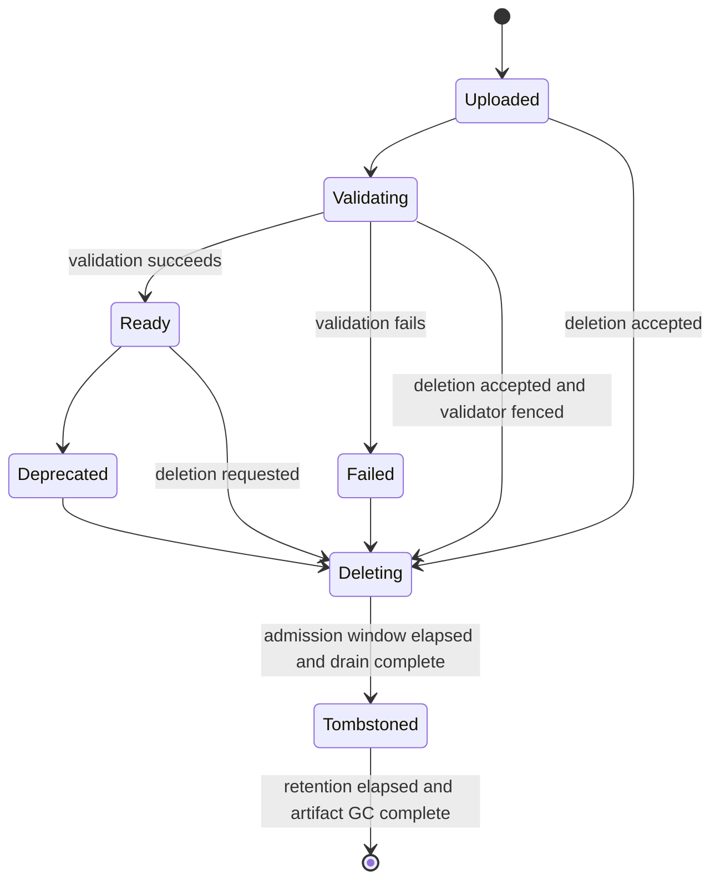

### 11.2 Function 状态机

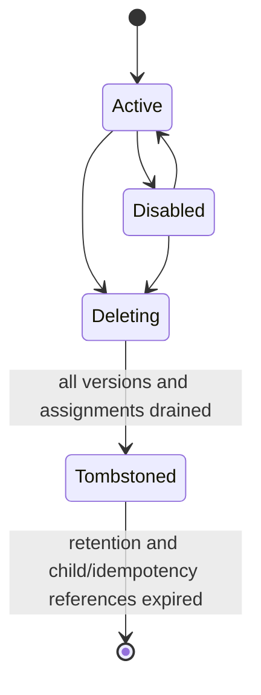

### 11.3 Worker 状态机

Worker 的控制意图、会话活性和排空进度是三个正交维度，不能压缩为一个互斥枚举。只有控制意图写入 Raft；会话与排空状态由当前 Leader 根据 Observation 派生。

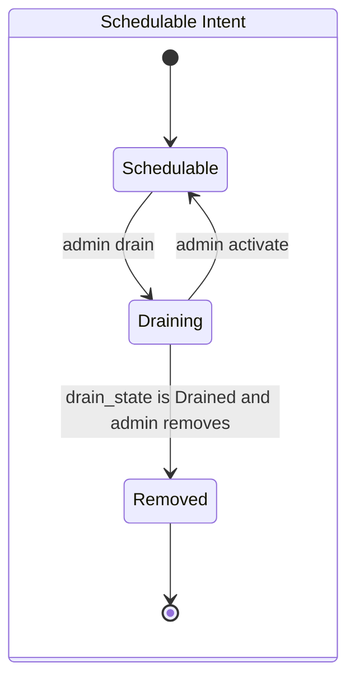

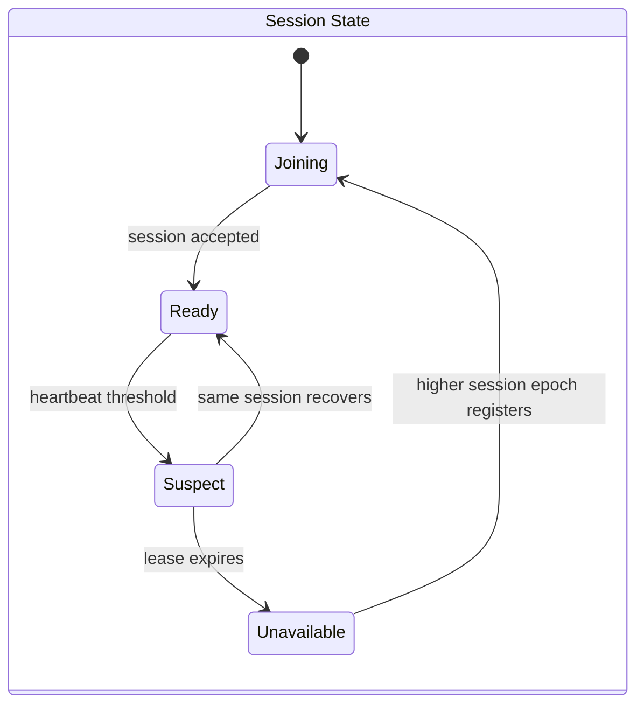

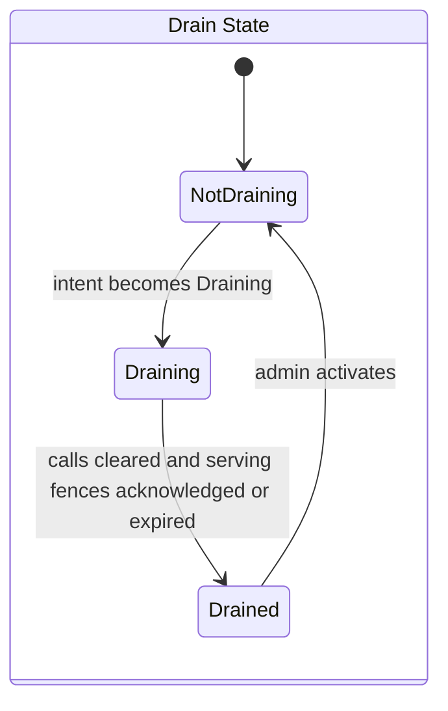

`session_state=Unavailable` 可以与 `schedulable_intent=Draining`、`drain_state=Draining/Drained` 同时存在。Activate 只改变控制意图；Worker 仍必须以更高 Session Epoch 注册并重新建立 Assignment，才能恢复 Ready。

### 11.4 Async Invocation 状态机

本状态机只适用于持久异步 Invocation。同步调用只有瞬时 `Attempt` 与最终 `Outcome`，不得为记录同步状态而把调用热路径写入 Raft 或异步队列。

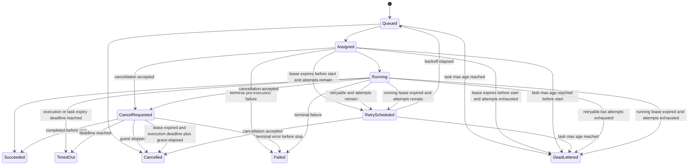

### 11.5 Deployment 期望生命周期与派生条件

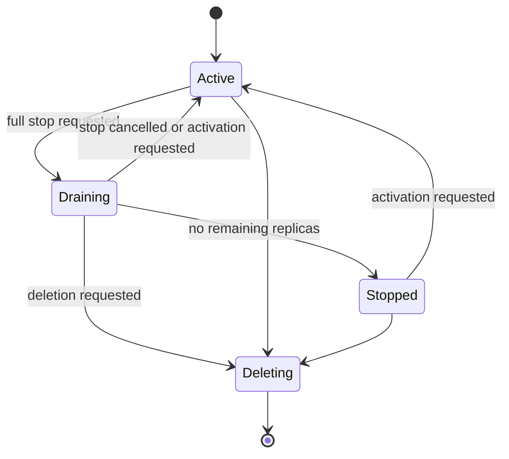

普通扩容或部分缩容只修改 `desired_replicas`，Deployment 保持 `Active`；超出新 Desired 的 Assignment 单独进入 Draining。Deployment 的 `Draining` 仅表示整部署停止流程。

`Progressing/Ready/Degraded/Failed` 是 Controller 根据 Assignment 和 Worker Observation 计算的 Condition，不允许外部 Observation 直接驱动 Raft FSM。Condition 必须包含 `reason`、`observed_generation` 和更新时间；新 Leader 可重算。

### 11.6 Replica/Assignment 状态机

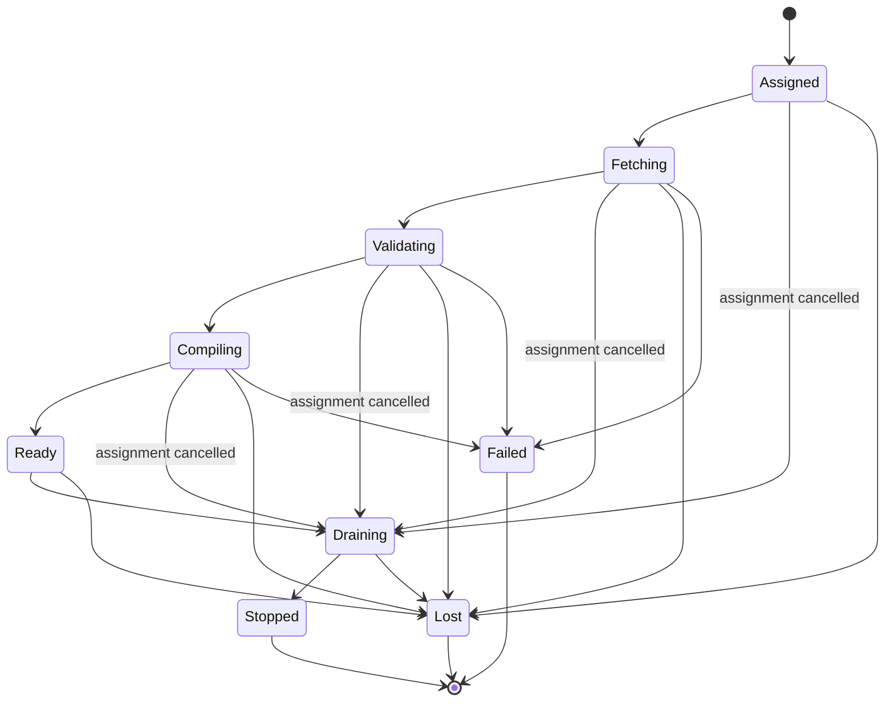

### 11.7 Route Revision 状态机

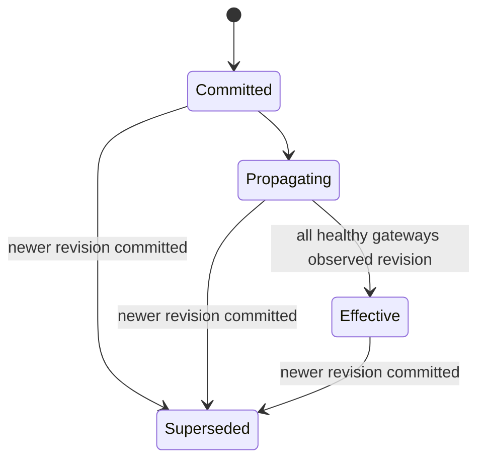

回滚必须创建新的 `Committed` Route Revision。已经开始的请求继续使用其选定版本；新请求在 Gateway 原子切换快照后使用新 Route Revision。

`Committed` 表示不可变 Route Revision 已存在；新提交只切换 Function 的 Active Route 指针，不改写旧 Revision。`Superseded` 是根据该控制指针派生的确定性关系，`Propagating/Effective` 是根据 Gateway Watch Acknowledgement 派生的 Observation Condition；三者都不得通过覆盖历史 Route 内容实现。

### 11.8 Trigger 状态机

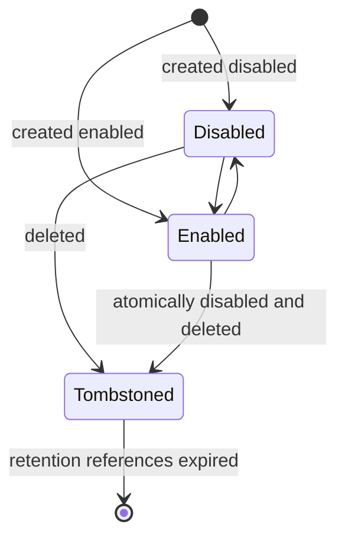

Trigger 的 `Healthy/Error` 是派生 Condition。队列故障不得自行改写 `enabled` 配置；管理员修复后无需覆盖原配置即可恢复投递。

### 11.9 EventSource 状态机

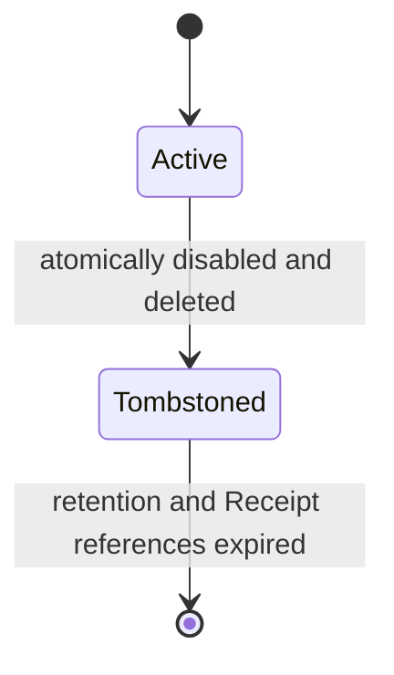

EventSource 的 `enabled` 是 Active 生命周期内的独立配置开关。Tombstoned Source 不得重新启用或认证新事件，只可按 TRG-010 确认既有 Receipt；同名 Source 只能在 Tombstone 硬删除后以全新且不可复用的 ID 创建。

状态机实现必须拒绝未在图中或补充转换表中定义的转换。Raft 控制对象转换必须记录调用者和旧/新 `resource_revision`；Worker/Replica 等 Observation 转换记录 Worker Session、Observation Sequence 与原因，不虚构 Resource Revision。

取消语义必须单独处理：Queued/RetryScheduled 状态保证取消；Assigned/Running 只进入 `CancelRequested` 并尽力传播，最终仍可能 Succeeded、Failed 或 TimedOut。CancelRequested 后不再续租或重投；Worker 丢失时，Task Store 只有在 Lease 过期且原 Attempt 执行 Deadline 加 `async_cancellation_grace` 已过后才能以 CAS 进入 Cancelled。API 不得在 Guest 仍可能产生副作用时提前声称 Cancelled；Cancelled 也不表示此前绝无外部副作用。

## 12. 一致性、可用性与故障语义

| 场景 | 控制面行为 | 数据面行为 | 客户端可见结果 |
| --- | --- | --- | --- |
| 单个 Follower 故障 | 保持读写，多数派提交 | 不受直接影响 | 控制操作继续成功，状态显示 Degraded |
| Leader 故障 | 短暂拒绝/重试，重新选主 | Gateway 使用完整 ServingSnapshot LKG，Worker 使用未过期 Authorization | 已有 Ready Endpoint 可在配置窗口内继续；控制写短暂不可用 |
| 控制集群失去多数派 | 拒绝写和线性读，不调度、不迁移、不从零激活 | 只有 Gateway LKG 与 Worker Serving Authorization 同时有效的 Ready Replica 可继续；Event Ingress 因不能线性读取认证/匹配配置而 Fail Closed；到期后 Worker 不领取新异步任务 | 写与新 Event 返回 `no_quorum`；零副本/无 Endpoint 返回 503；已持久任务等待恢复或过期 |
| Gateway 与控制面分区 | 不影响 Raft | 使用本进程已 Full Sync 的带校验和 ServingSnapshot LKG，最多 `serving_max_stale`（默认 5 分钟）；Function/Trigger/Route/Auth 均不单独续期，被动探活只可摘除坏 Endpoint | 响应标注陈旧状态指标；Gateway 重启后必须重新 Full Sync，否则 Fail Closed |
| Worker 心跳丢失 | Leader 标记 Suspect/Unavailable，Connected Gateway 获取新 ServingSnapshot | Connected Gateway 摘除；与控制面分区的 Gateway 依靠被动探活，可能在 LKG 窗口内短暂命中旧 Endpoint | 同步在途/首次失败可能返回 `worker_lost`；异步租约到期重投 |
| Worker 执行中崩溃 | Reconcile 恢复副本 | 已开始的同步不透明重试 | 同步返回 `worker_lost`；异步至少一次 |
| Worker 与旧 Leader 分区后恢复 | 新 Leader 使用更高 Discovery Epoch、Session 或唯一替代 Assignment 收敛；无策略变化时不虚增 Deployment Generation | 允许短暂副本重叠，但旧 Endpoint 不重新进入新 ServingSnapshot | 不承诺严格单活；相同异步任务仍以 Invocation ID 去重 |
| Artifact Store 不可用 | 既有元数据可读 | 已缓存版本可继续，冷启动失败 | 返回 `artifact_unavailable` |
| Async Queue 不可用 | 控制操作和同步可继续 | 新异步/Cron/Event 无法持久接收 | 明确返回服务不可用，不伪造 202 |
| Observability/Audit 后端不可用 | 核心流程继续；控制审计留在 Raft Outbox | 普通日志/指标/Trace 使用本地有界缓冲，超限丢弃并计数；审计导出重试 | 不以遥测故障阻塞业务；已提交控制审计不丢失，Outbox 达硬上限时新的受审计控制写 Fail Closed |
| 时钟跳变 | Raft Apply 不读取墙钟；不可信前跳暂停破坏性 Cutoff | Deadline 使用单调时钟；Durable Lease/任务到期经过 ClockGuard；Cron 按错过策略和 Fire ID 去重 | 不提前 GC/重投，不产生无限补发；状态显示 Clock Degraded，后跳可延迟回收 |

## 13. 非功能需求

### 13.1 可用性与恢复目标

以下目标在记录的参考环境中验证，测试报告必须注明 CPU、内存、操作系统、Runtime 版本、模块大小和负载：

| ID | 优先级 | 目标 |
| --- | --- | --- |
| NFR-AVL-001 | P0 | 3 节点控制集群失去任意 1 节点后仍可提交控制写。 |
| NFR-AVL-002 | P0 | 100 次 Leader 故障注入中，95% 在 5 秒内恢复可写 Leader。 |
| NFR-AVL-003 | P1 | 从 Worker 进程停止开始计时，95% 的缺失 Replica 在 15 秒内于其他 Worker 进入 Ready；无资源时明确 Degraded。 |
| NFR-AVL-004 | P0 | 进程重启后，所有已确认提交的控制状态必须恢复。 |
| NFR-AVL-005 | P1 | 已确认持久化的异步任务在单个任务服务进程重启后不得丢失。 |
| NFR-AVL-006 | P1 | Route 提交后，全部健康且 Watch 已连接的 Gateway 在 2 秒内观察完整新 Route Revision（P95）。 |
| NFR-AVL-007 | P0 | 任何节点从相同 Snapshot + WAL 恢复后必须得到相同 Raft Applied Index 和 State Digest。 |
| NFR-AVL-008 | P0 | 在参考 Local Profile 有充足容量时，单次 Worker 强停后替代 Replica 必须在 60 秒内 Ready。 |

### 13.2 性能与容量目标

性能目标是工程基线，不覆盖安全与正确性要求：

| ID | 优先级 | 目标 |
| --- | --- | --- |
| NFR-PERF-001 | P1 | 对空操作 Warm-instantiate 函数，平台附加延迟 P95 不超过 20 ms，测试不含公网和 Guest 业务耗时。 |
| NFR-PERF-002 | P1 | 对 Artifact 已本地缓存、Compiled Module 未命中且大小不超过 5 MiB 的模块，Compile-cold 到可实例化 P95 不超过 250 ms。 |
| NFR-PERF-003 | P1 | 单 Gateway + 2 Worker 在参考 8 核/16 GiB 机器上对空操作函数达到至少 500 RPS，错误率低于 0.1%。 |
| NFR-PERF-004 | P1 | 10% 灰度在至少 10000 个独立 Affinity Key 下，观测占比与目标差不超过 1.5 个百分点。 |
| NFR-PERF-005 | P0 | 所有队列、缓存、日志/遥测缓冲和并发均必须有配置上限；达到上限时必须拒绝、断开并要求 Resync，或丢弃允许丢失的遥测并计数。`/v1/limits` 与有效配置必须枚举每一处上限，压力测试不得出现无界增长。 |
| NFR-PERF-006 | P1 | 对 Compiled Module 命中的零副本函数，首次 Activation + Warm-instantiate 完成时间 P95 不超过 1.5 秒。 |

实现阶段必须先运行探索基准并通过 ADR 冻结参考环境、负载、统计方法和数值门槛，之后才运行正式发布验收。正式验收失败后不得通过修改门槛、样本或统计口径使结果转绿；任何调整都必须进入下一发布周期并保留原失败证据。

### 13.3 安全要求

| ID | 优先级 | 需求 |
| --- | --- | --- |
| NFR-SEC-001 | P0 | 管理 API 至少支持静态管理员 Token；Token 必须映射到独立配置且稳定的 `admin_subject`，不得以 Token 摘要作为 Operation/Audit Principal，因此带外替换 Token 不改变去重身份。非开发部署必须支持 TLS。 |
| NFR-SEC-002 | P2 | Cluster Profile 的 Controller/Worker 节点身份必须支持 mTLS。 |
| NFR-SEC-003 | P0 | 认证信息使用常量时间比较或成熟库，失败响应不得泄露 Token 存在性。 |
| NFR-SEC-004 | P0 | 运行时威胁模型必须把 Guest 模块和调用输入视为不可信。 |
| NFR-SEC-005 | P0 | Artifact、JSON、Header、Cron、标签和所有外部输入必须有大小、数量和语法上限。 |
| NFR-SEC-006 | P0 | 管理接口与调用接口必须使用不同权限和可独立绑定的监听地址。 |
| NFR-SEC-007 | P1 | 项目必须记录依赖清单、版本锁定方式和漏洞更新流程。 |
| NFR-SEC-008 | P0 | Chaos、成员变更、认证 Token、Capability 和 Route 修改必须进入审计日志。 |
| NFR-SEC-009 | P0 | Invocation/Event Token 必须由 CSPRNG 生成至少 256 bit 熵，只将带域分离和独立 Salt 的成熟单向校验摘要写入控制状态；明文只在创建或轮换响应中返回一次，比较使用成熟常量时间方法。Operation Record、日志和审计不得保存明文；响应丢失时通过鉴权轮换恢复。 |

### 13.4 可维护性与可移植性

| ID | 优先级 | 需求 |
| --- | --- | --- |
| NFR-MNT-001 | P0 | 控制面、Gateway、Worker、Runtime、Artifact 和 Queue 必须通过接口解耦，避免循环依赖。 |
| NFR-MNT-002 | P0 | 所有持久格式和网络 API 必须版本化。 |
| NFR-MNT-003 | P0 | 配置优先级必须固定为 CLI > 环境变量 > 配置文件 > 默认值，并可打印去敏后的有效配置。 |
| NFR-MNT-004 | P0 | 默认配置必须适合 Local Profile，启动错误必须包含具体修复方向。 |
| NFR-MNT-005 | P1 | 支持优雅关闭：停止接收、排空、刷盘并在 Deadline 后退出。 |
| NFR-MNT-006 | P1 | 代码和协议应避免依赖 Linux 专属容器能力，使本地档位可跨平台。 |
| NFR-MNT-007 | P0 | 时间、随机、故障网络和存储边界必须可注入；TTL、退避和多日保留测试使用可控时钟，不依赖真实长时间 Sleep。 |

## 14. 配置基线

| 配置 | 默认值 | 合法范围/说明 |
| --- | --- | --- |
| Controller voters | 3 | v1 固定为 3；其他数量和动态成员均属于 P2。 |
| Worker heartbeat | 2s | 500ms..30s。 |
| Worker suspect | 6s | 必须大于 heartbeat。 |
| Worker unavailable | 10s | 必须大于 suspect。 |
| Worker drain grace | 30s | 1s..10m；到期后取消剩余调用，Drained 仍须等待服务 Fence ACK/过期。 |
| Leader inventory grace | 3s | 0..10s；收到确定失败证据可提前恢复，且计入 Worker 恢复 SLO。 |
| Serving max stale | 5m | 合法范围 0..10m；0 表示只在健康控制 Watch 连接期间服务，连接断开立即 Fail Closed。 |
| Worker serving authorization | 5m | 合法范围 0..10m 且小于等于 Serving max stale；0 表示 `live_only`，只在健康控制 Session 期间接受新工作。 |
| Serving authorization refresh | 1m | 非零 TTL 时必须小于 TTL/2，且每次刷新前确认多数派联络；`live_only` 使用控制 Session Keepalive，不按零时长计时。 |
| Route history | 7d / 100 revisions | 1h..30d / 10..1000；仅用于 Superseded，显式 Pin 和当前 Active Revision 不自动回收。 |
| Route pinned revisions | 20 / function | 超限前必须先 Unpin。 |
| Function timeout | 5s | 上限默认 30s；包含完整调用链。 |
| Runtime cancellation grace | 1s | 配置键 `runtime_cancel_grace`；Deadline 后允许 Runtime 清理，合法范围 100ms..10s。 |
| Function linear memory tier | 128 MiB | 可选 64/128/256/512 MiB；不等于 Worker RSS。 |
| Management JSON body | 1 MiB | 上传 Artifact 字节单独按 Artifact size 限制；原始 Body 在解析前限制。 |
| Manifest | 256 KiB | UTF-8 JSON，深度和重复 Key 规则与其他 JSON 一致。 |
| Request body | 1 MiB | 管理员可降低。 |
| Response body | 1 MiB | 管理员可降低。 |
| Raw RequestEnvelope | 1.5 MiB | JSON 解析前强制。 |
| Raw stdout | 1.5 MiB | JSON 解析前强制，按正文 Base64 上限加元数据预算计算。 |
| Envelope metadata | 128 KiB | 包含 Header、Query 和 Trigger 元数据。 |
| Header | 64 / 32 KiB total / 8 KiB value | Request 与 Response 分别执行。 |
| Query | 128 pairs / 32 KiB total | 重复 Key 保留顺序。 |
| HTTP method/path | 16 / 4096 bytes | Method 必须匹配 HTTP Token 并规范为大写；Path 拒绝 NUL、无效 UTF-8/Percent Encoding 和越界长度。 |
| JSON depth | 32 | 重复 Key 拒绝。 |
| Event data/raw envelope | 1 MiB / 1.5 MiB | `data` 的 JCS 字节与原始 EventEnvelope 分别限制；JSON 解析前先限制原始字节。 |
| Event fan-out | 32 triggers | 超限在任何入队前拒绝。 |
| Event expanded fan-out | 8 MiB | 所有 Delivery Plan 的渲染载荷及引用元数据总和；超限不创建 Receipt。 |
| Trigger payload template | 64 KiB | v1 仅接受无表达式 JSON Literal；JCS 序列化 Body 仍受目标正文上限约束。 |
| Cron expression/timezone | 128 / 64 bytes | 表达式只接受 5 字段语法；时区必须在锁定 IANA 数据库中精确存在。 |
| Event source/type | 128 / 128 bytes | Source 匹配 `[a-z][a-z0-9_.-]{0,127}`；Type 为非空可打印 ASCII。 |
| Labels | 32 entries | Key 最多 63 字节并匹配数据模型语法；Value 最多 256 UTF-8 字节。 |
| Client identifier | 128 bytes | Request/Operation/Idempotency/Event ID 为 1..128 个 `[A-Za-z0-9._:-]` 字符。 |
| Generated token entropy | 256 bits | Invocation/Event Token 使用 CSPRNG；编码后最多 128 字节，静态管理 Token 至少 32 字节。 |
| Admin subject | `local-admin` | 1..128 个 `[A-Za-z0-9._:-]` 字符；Token 带外轮换时保持不变。 |
| List pagination | 100 / max 1000 | Cursor 最多 4 KiB、默认 24h 到期并受完整性保护。 |
| Route targets | 32 / revision | 超限在提交前拒绝；权重总和规则不变。 |
| Invocation logs | 256 KiB | 超出截断并计数。 |
| Invocation log line | 16 KiB | 控制字符和 ANSI Escape 清理。 |
| Worker guest-log rate/buffer | 1 MiB/s / 4 MiB | 超出丢弃并计数，不阻塞 Guest。 |
| Gateway inflight/wait queue | 1024 / 1024 | 分别按 Gateway 和 Function 施加；满时返回 `overloaded`。 |
| Gateway invocation rate/burst | 1000/s / 2000 | 每 Gateway 本地 Token Bucket；不宣称全局精确。 |
| Management rate/burst | 100/s / 200 | 每 Management 实例本地限制，过载不进入 Raft。 |
| Worker guest slots | 64 | 合法范围 1..1024，并受承诺内存预算进一步限制。 |
| Worker Artifact/Compiled cache | 10 GiB / 10 GiB | 独立硬上限；达到后按有界 LRU/近似 LRU 淘汰。 |
| Validator concurrency/resources | 2 / 30s / 512 MiB / 512 MiB temp | 分别为并发、Deadline、内存和临时磁盘硬上限。 |
| Reconcile concurrency | 32 | 超出工作合并，不创建无界 Goroutine。 |
| Reconcile retry | 500ms base / 30s max | 指数退避与抖动；相同 Key 工作合并。 |
| Watch client queue | 1024 events | 队列满断开 Client；重连按 Cursor 或 Full Sync 恢复。 |
| Internal RPC | 4 MiB / 10s / 256 concurrent | 消息、默认 Deadline 和每 Peer 并发上限；具体 RPC 可更低。 |
| Telemetry export buffer | 16 MiB / component | 满时只丢允许丢失的日志/指标/Trace 并增加 dropped 计数。 |
| Trace sampling | 1.0 Local Profile | 合法范围 0..1；发布 E2E 固定 1.0，采样决定不得使用业务正文或 Secret。 |
| Metrics series | 1000 / metric | 可选细分指标达到上限后丢弃新 Series 并计数；默认指标不得使用资源 ID。 |
| Audit retention/outbox | 30d / 100000 events / 256 MiB | 未确认导出的事件不因年龄删除；达到任一硬上限且无可 GC 记录时，新的受审计控制写 Fail Closed。未配置外部 Sink 时，Raft 内本地查询视为 Sink。 |
| Control object safety maxima | 1000 functions / 100 versions per function / 100 triggers per function / 1000 event sources / 1000 worker identities | Local Profile 硬安全上限，不提供租户公平性或可借用配额语义。 |
| Operation records | 100000 | 包含结果记录与过期 Tombstone；达到上限时先运行合格 GC，否则拒绝新控制写。 |
| Artifact size | 32 MiB | 管理员硬上限 256 MiB。 |
| Artifact temporary upload TTL | 24h | 仅清理未原子发布的临时对象；活跃上传持有 Lease。 |
| Artifact orphan grace | 48h | 从 Blob 原子发布起算，必须大于等于 `control_operation_ttl + deletion_safety_margin`。 |
| Min replicas | 1 | 合法范围 0..max_replicas；设置 0 才允许 Scale to Zero。 |
| Max replicas | 10 | 合法范围 1..100。 |
| Target concurrency | 10 / replica | 合法范围 1..1000，且受 Worker 和 Version 并发上限约束。 |
| Autoscale evaluation/cooldown | 2s / 30s | 扩容不等待 Cooldown，缩容等待。 |
| Deployment progress deadline | 60s | 超时后设置 Degraded Condition，但 Reconcile 继续。 |
| Idle timeout | 60s | 10s..24h。 |
| Async attempts | 3 | 1..10。 |
| Async retry backoff | 1s base / 30s max | 指数退避并加入抖动。 |
| Async retry timeout | false | 全局管理员开关；启用表示 Timeout 可按剩余 Attempt/时间预算重试，并在状态/指标中明确。 |
| Async lease/renew | 30s / 10s | Renew 周期必须小于 Lease/2；每次到期点不得越过 Attempt Execution Deadline。 |
| Async Task Store logical capacity | 100000 nonterminal tasks / 10 GiB retained data | 字节上限覆盖载荷、Receipt、Fire、结果和 Tombstone；达到任一上限拒绝新异步/Cron/Event，不提前删除未过期记录，也不影响同步。 |
| Async task max age | 24h | 合法范围 1m..30d；从 Invocation `created_at` 起算，为完整非终态生命周期硬上界，未开始任务进入 `DeadLettered`，运行 Attempt 按截短 Deadline 进入 `TimedOut`。 |
| Async submit timeout | 10s | 1s..60s；超时提交票据必须失效，不能在响应后迟到入队。 |
| Cron stale producer window | 5s | 合法范围 1s..30s；旧 Leader 无法确认多数派后停止 Cron 生产的上界。 |
| Cron Fire Record TTL | 7d | 只回收已完成且无待处理 Outbox 的 Record；Cron Cursor 独立保留到 Trigger Tombstone GC。 |
| Async result TTL | 24h | 从 Invocation 进入终态的时间起算；合法范围 1h..30d。 |
| Async expiry tombstone TTL | 7d | 从结果回收起算；合法范围 1d..30d，在此期间查询稳定返回 410。 |
| Idempotency TTL | 48h | 合法范围 1h..90d；从首次接受时间起算，不得短于 `async_task_max_age + async_result_ttl`。 |
| Event dedup TTL | 48h | 合法范围 1h..90d；从首次接受事件起算，不得短于 `async_task_max_age + async_result_ttl`。 |
| Async cancellation grace | 5s | 配置键 `async_cancellation_grace`；从 Attempt 执行 Deadline 起附加，不得短于 `runtime_cancel_grace`。 |
| Control Operation TTL | 24h | 合法范围 1h..30d；从终态 `completed_at` 起算，不得短于客户端最大重试窗口。 |
| Control Operation tombstone TTL | 7d | 合法范围 1d..30d；从终态结果记录回收起算，期间 Operation ID 不得复用，查询稳定返回 410。 |
| Host API calls | 100 / invocation | 仅适用于启用的自定义 Host API。 |
| Host API total I/O | 4 MiB / invocation | P2；每种 API 仍有更小单次上限。 |
| Deletion safety margin | 1h | Tombstone 公式的附加窗口。 |
| Deletion quiescence | 30s | Task Store Watermark 越过 Cutoff 后连续零任务观察窗口。 |
| Version tombstone grace | 8d | 必须满足 FN-008 公式，可因其他配置自动要求更大。 |
| Control resource tombstone TTL | 30d | Function/Version/Trigger 等元数据至少保留该时长，且所有引用与特定 GC 条件消失后才可硬删除。 |
| Snapshot check | 10000 entries / 64 MiB | 任一阈值触发检查。 |
| Wall clock forward-step guard | 5m | 墙钟相对本进程单调经过时间前跳超过该值时，暂停 TTL GC、保留回收和 Task 到期推进，设置 Degraded 并要求时钟恢复或管理员确认；后跳只延迟回收。 |
| Controller clock skew | 2s | 当前 Leader 在 Cron 或破坏性 GC Cutoff 前采样多数派；任意样本最大差值超限时暂停对应动作。 |

所有持续时间和容量配置必须在启动时做关系校验。无效组合必须拒绝启动或拒绝控制写，不能静默修正。

Serving Authorization TTL、调用 Deadline 和进程内故障检测使用本地单调经过时间。Durable Task Lease、Route/Operation/Invocation 等跨重启期限使用持久 UTC 锚点：Task Store 在单次进程运行中以本地单调 Timer 调度 Lease，到期状态以 CAS 持久化；重启后按 UTC 锚点保守重建，并同样经过前跳保护。Raft 中的保留/GC 使用通过多数派时钟偏差检查的 UTC 与确定性 Cutoff Command。检测到不可信前跳/偏差时宁可延迟 Lease 重投或回收，不能提前 GC Artifact、幂等记录、审计或任务；所有 ClockGuard 分支必须可注入测试。

本文按 Duration 声明的到期上界以 ClockGuard 未触发、时钟处于配置误差范围内为验收前提。ClockGuard 触发是显式 Degraded 安全例外：允许延迟任务终态和回收，但不得提前过期；状态与指标必须暴露被暂停的计时器类别和持续时间。

上述 Control Object 与 Task Store 数值是防止资源耗尽的实现安全上限，不是 NOGOAL-007 所排除的多租户 Namespace 配额、计费或公平调度。达到安全上限必须返回 `overloaded` 并暴露当前值/上限，不能静默淘汰活跃控制对象或非终态任务。

未启用 P1 异步能力时，`effective_async_task_max_age=0` 且 `async_ingress_stale_window=serving_max_stale`；启用后前者等于 `async_task_max_age`，后者等于 `max(serving_max_stale, cron_stale_producer_window)`（Cron 未启用时第二项为 0）。这些派生值只用于删除与 GC 关系校验，不改变调用或任务自身过期语义。

## 15. 测试与验收策略

### 15.1 测试层次

| 层次 | 必须覆盖 |
| --- | --- |
| 单元测试 | 状态机、权重路由、Resource/Route Revision、资源校验、错误映射、重试退避。 |
| 属性/模糊测试 | Envelope、WASM 导入、Header、Cron、错误 JSON、Route 权重。 |
| 组件测试 | WAL/Snapshot、Artifact 原子写、Queue 重启恢复、Runtime 限制。 |
| 多进程集成测试 | 3 Controller、2 Worker、Gateway 的启动、发布、调用、扩缩。 |
| Chaos 测试 | Leader、Follower、Worker、网络分区、延迟、磁盘/制品故障。 |
| 性能测试 | Warm/Cold 延迟、吞吐、灰度分布、缓存和资源泄漏。 |
| 安全测试 | Capability 逃逸、Secret 泄漏、未授权管理、输入上限和 SSRF。 |

### 15.2 验收场景目录

Gate 为 P0/P1 的场景分别组成 Core/Showcase 发布门槛；P2 场景只记录未来扩展证据，不计入 v1.0。

| ID | Gate | 层次 | 场景 | 通过条件 |
| --- | --- | --- | --- | --- |
| E2E-001 | P0 | 多进程 | 发布并同步调用 | Go 示例函数发布为 Ready，以单目标 Route 通过稳定 URL 返回正确结果、Version 和 Route Revision。 |
| E2E-002 | P0 | 组件+集成 | 非法模块 | 损坏、未知 Import 或未启用 Feature 模块进入 Failed，永不接收流量。 |
| E2E-003 | P0 | API+多进程 | 不可变版本与删除 | Ready Version 修改被拒绝，新发布生成新 Version；Enabled Route 引用时删除冲突，发布 Disabled 空 Route 后只在 LKG/Assignment 排空且无 Pin 时进入 Tombstone。 |
| E2E-004 | P0 | Chaos | Leader 故障 | 连续调用过程中由外部 Harness 停止 Leader；调用按 LKG 继续，控制面 P95 在 5 秒内恢复。 |
| E2E-005 | P0 | Chaos | 少数派隔离 | 隔离 1 个 Controller；少数派不能写，多数派提交状态不回退。 |
| E2E-006 | P0 | Chaos | Worker 故障闭环 | 在充足容量下，从 Worker 进程停止起，旧会话被摘除，替代 Replica 在 60 秒内 Ready。 |
| E2E-007 | P1 | 基准 | 灰度与稳定性 | 90/10 Route 满足分布误差；同 Affinity Key 在同 Route Revision、跨全部兼容 Gateway 上稳定。 |
| E2E-008 | P1 | 多进程 | 原子回滚 | 可用历史回滚创建新 Route Revision，一次提交恢复旧版本且无 Artifact 重建；历史中弃用前已存在的 Deprecated Target 可恢复但不可新增。Pin 阻止依赖删除，未 Pin 依赖显式删除后返回 `rollback_unavailable`。 |
| E2E-009 | P1 | 多进程+基准 | Scale to Zero 正向 | 健康、有容量且缓存命中时归零后的首个请求必须成功，激活 P95 不超过 1.5 秒。 |
| E2E-010 | P1 | 组件+集成 | 异步持久化与过期 | 接收 202 后重启队列/任务消费者，Invocation 仍存在并进入终态；可控时钟依次验证结果可查、Tombstone 期间 410、Tombstone 到期后 404。 |
| E2E-011 | P1 | Chaos | 异步至少一次 | Worker 在 Running 中死亡，任务租约到期后以相同 Invocation/Version 重投，Attempt 可见。 |
| E2E-012 | P1 | 并发 | 幂等提交 | 100 个并发相同 Key+摘要只创建一个逻辑 Invocation；Route 改变后的相同请求仍返回原 Invocation/Version，不同业务摘要返回 409。 |
| E2E-013 | P1 | Chaos+可控时钟 | Cron Leader 切换 | 触发边界切换 Leader并回收旧 Fire Record；从持久 Cron Cursor 恢复后 Fire ID 仍去重且符合错过策略，Controller 时钟偏差超限时暂停推进。 |
| E2E-014 | P0 | 安全 | Capability 基线 | 固定 WASI Profile 可运行；默认无文件 Preopen、宿主环境不可见、网络不可用，时钟/随机数等锁定 Baseline 正常。 |
| E2E-015 | P0 | 安全+压力 | 资源隔离 | 无限循环、内存增长、大输出、并发/队列/缓存和日志洪泛均命中 `/v1/limits` 声明的边界，拒绝或淘汰行为稳定，Worker 仍可调用健康函数且无无界增长。 |
| E2E-016 | P0 | 组件+多进程 | Snapshot 恢复 | 触发 Snapshot/Compact，重启全部节点后恢复相同 Applied Index、对象和 State Digest。 |
| E2E-017 | P0 | Chaos | Gateway LKG | 控制失联时完整 ServingSnapshot LKG 在窗口内继续；超过窗口 Fail Closed；Gateway 重启后未 Full Sync 也 Fail Closed；Function/Trigger/Route/Auth 不单独续期，Epoch/Sequence 不倒退。 |
| E2E-018 | P1 | 安全+Chaos | Chaos 权限 | 默认无法调用；启用后仍需管理员身份，外部 Harness 动作可审计、可恢复。 |
| E2E-019 | P0 | 多进程+Chaos | Drain | 健康 Worker Drain 后不接收新调用，在途调用于宽限内结束并在服务 Fence ACK 后 Drained；隔离 Gateway/Worker 时在旧许可过期前保持 Draining。心跳丢失不覆盖 Intent，Activate 必须以更高 Session Epoch/新 Assignment 恢复，Removed Worker 不可再注册。 |
| E2E-020 | P0 | 安全 | 平台敏感信息 | 平台生成的日志、Trace、Raft、Snapshot 不自动传播测试 Secret/认证 Header；Guest stderr 单独标识和授权。 |
| E2E-021 | P0 | Chaos+API | 控制写结果未知 | Commit 后响应前断线；普通写以同 Operation ID+Digest 返回原资源结果，不同 Digest 409；可控时钟验证 TTL 后复用/查询 410、Tombstone 后 404。一次性 Token 写不重复创建资源、不重放明文并可轮换恢复；Audit Backend 中断时同 Command 的 Outbox 事件仍存在且恢复后只导出一次。 |
| E2E-022 | P0 | 受控组件故障 | WAL/Snapshot 恢复 | 未提交 Torn Tail 可审计截断；中段/已提交损坏 Fail Closed；最新 Snapshot 损坏可从前一份恢复。 |
| E2E-023 | P2 | 多进程 | 动态成员 | Learner 追平后提升并安全移除成员；危险/并发变更被拒绝。 |
| E2E-024 | P0 | 受控组件故障 | Artifact 事务 | 在上传、Blob 发布和 Version Commit 边界崩溃；无半版本，Orphan 仅在宽限后回收。 |
| E2E-025 | P0 | Chaos+并发 | 快照原子性 | 丢弃或乱序 Function/Trigger/Route/Endpoint 子更新；Leader 只发布完整 ServingSnapshot，Gateway 断档后 Full Resync，请求只观察旧或新完整服务配置。 |
| E2E-026 | P0 | Chaos | 全集群重启 | 连续成功管理写后强停全部 Controller；重启后每个成功 Resource Revision 都存在且 State Digest 收敛。 |
| E2E-027 | P0 | 安全 | Guest 状态隔离 | Guest 修改全局与线性内存后退出或 Trap；下一次调用仍观察初始状态。 |
| E2E-028 | P2 | 安全+模糊 | 自定义 Host API | 溢出 Pointer/Length、伪造身份和 Host Panic 不越权、不终止 Worker。 |
| E2E-029 | P0 | Chaos | 无多数派复合故障 | 无多数派时再停止唯一 Worker；Gateway 摘除 Endpoint，但不虚构迁移或激活。 |
| E2E-030 | P1 | 并发+基准 | 并发冷启动 | 每 Worker/Cache Key 只 Fetch/Compile 一次；一次伸缩波次可创建受 `max_replicas` 限制的多个 Assignment。 |
| E2E-031 | P0 | 兼容 | Toolchain/ABI | 锁定标准 Go Fixture 正确处理 Unicode、重复 Query/Header 和二进制正文；TinyGo 仅在启用时独立验收。 |
| E2E-032 | P1 | 集成 | Event Ingress | 当前配置认证、去重窗口及到期边界、Fan-out、不保证顺序、无 Quorum Fail Closed 和全量持久确认符合 TRG-010..014；首次接受后改变 Trigger/Route，相同 Event 重试仍只补齐原 Receipt 匹配集合。 |
| E2E-033 | P1 | 可观测 | Trace 与决策解释 | 一次同步、异步和冷启动均可关联日志/Trace/指标，并显示 Route、Version、Replica 和阶段耗时。 |
| E2E-034 | P0 | 合同 | API 与 CLI | OpenAPI/Schema、稳定错误、基于 Raft Index 的分页、Resource/Active Route Revision CAS、Operation 查询、`/v1/limits`、JSON CLI 及 Management/Invocation/Event/Node 认证边界均通过合同测试。 |
| E2E-035 | P1 | Chaos | Scale to Zero 负向 | 无多数派或无合格 Worker 时零副本函数在有界时间返回 503，不创建 Assignment。 |
| E2E-036 | P0 | Chaos+一致性 | 分区旧 Leader | 旧 Leader 存活但失去多数派，不能线性读写/刷新许可；已观察新 Epoch 的消费者拒绝旧消息，孤立消费者在 TTL 后自停。 |
| E2E-037 | P0 | 多进程 | Session 与 Failover Grace | 健康 Leader 切换不发布空 Endpoint/重复 Assignment；同 Boot ID 以更高 Session 重连，旧 Session 回报被拒绝。 |
| E2E-038 | P0 | Chaos+可控时钟 | LKG/Serving 边界 | Gateway 重启、ServingSnapshot 或 Worker Serving Authorization 过期均停止新工作；`serving_max_stale=0`/`live_only` 在 Session 断开立即停止，墙钟回拨/前跳不改变单调 TTL，前跳超限暂停破坏性 GC，Token 轮换不延长旧认证配置。 |
| E2E-039 | P1 | 组件+并发+可控时钟 | Async Lease 与 Late Completion | Assigned Lease 反复过期按 Attempt/时间预算进入终态，RetryScheduled 可取消；Attempt 1 过期、Attempt 2 完成后迟到结果不能覆盖；Cancel/Complete 遵循 CAS，CancelRequested 只于 Lease 和执行 Deadline+Grace 均过期时 Cancelled，任务最迟于 `expires_at` 终结。 |
| E2E-040 | P1 | 组件+多进程 | Tombstone 与入队竞态 | 删除与提交并发，故意让提交票据在 `async_submit_timeout` 前后完成；超时未持久写不迟到出现，所有已返回 202 的任务都能获得固定 Artifact，Watermark/Cutoff 不提前允许 GC。 |
| E2E-041 | P0 | 组件+多进程 | Bootstrap 与身份 | Bootstrap 仅一次，Data Dir 换 Node ID 被拒绝，1/3 节点无 Quorum 时不能自封。 |
| E2E-042 | P1 | Chaos | Cron 旧 Leader 窗口 | 隔离旧 Leader并更新/禁用 Trigger；迟到旧 Trigger Resource Revision Fire 不超过声明窗口和数量，之后停止。 |
| E2E-043 | P1 | Chaos+基准 | Worker 恢复 SLO | 100 次 Worker 强停实验中，从进程停止到替代 Replica Ready 的 P95 不超过 15 秒。 |
| E2E-044 | P1 | 模型+集成 | 自动伸缩与滞回 | 重放互不重叠的 Inflight/Async Ready/Activation Waiter 指标得到规定 Desired；混合负载按总和扩容，阈值抖动不反复缩放，信号陈旧时不归零，伸缩不改变 Deployment Generation。 |
| E2E-045 | P0 | 多进程 | Endpoint 负载选择 | 两个健康 Replica 都接收流量；人为增加一个 Endpoint 的 Inflight/延迟后，新调用优先选择较空闲 Endpoint。 |

### 15.3 发布证据

v1.0 发布必须保存以下可复查证据：

- 自动测试报告及失败重跑记录；
- 参考环境说明；
- 100 次 Leader 故障的恢复时间分布；
- Worker 恢复、吞吐和灰度分布报告；
- Fetch-cold、Compile-cold、Warm-instantiate 分阶段报告，并单列真实标准 Go Fixture；不得只用较小 TinyGo 制品证明性能；
- 管理资源的线性化历史检查结果，以及所有 Controller 的最终 State Digest；
- 一次完整 Chaos 演示脚本和机器可读输出；
- 已知限制与未完成 P2 清单；
- 状态 Schema 和 API 兼容性说明。
- 锁定 Go、WASM Runtime、WASI Profile、Wasm Feature 和可选 TinyGo 的兼容性 ADR。

## 16. 需求追踪矩阵

### 16.1 项目目标追踪

| 项目目标 | 主要需求 | 主要验收 |
| --- | --- | --- |
| GOAL-001 多进程集群 | RFT、WRK、SCH、DSC、RPC | E2E-004..006、016、017、019、026、029、036..038、041 |
| GOAL-002 Go WASM 调用 | FN、ART、ABI、RUN、RTE、SYN | E2E-001..003、014、015、027、031、034 |
| GOAL-003 控制面容错 | RFT、DSC、API | E2E-004、005、016、021、022、025、026、036、041 |
| GOAL-004 Worker 恢复 | WRK-001..011、SCH-001..014 | E2E-006、019、029、037、038、043 |
| GOAL-005 隔离与权限 | CAP、RUN、NFR-SEC | E2E-002、014、015、020、027；P2 E2E-028 |
| GOAL-006 灰度回滚 | RTE、DSC | E2E-007、008、025 |
| GOAL-007 Scale to Zero | SCL、RUN、SCH | E2E-009、030、035 |
| GOAL-008 异步和事件 | ASY、TRG | E2E-010..013、032、039、040、042 |
| GOAL-009 可观测与 Chaos | OBS、CHA | E2E-004..006、018、022、029、033、036、038、042 |
| GOAL-010 API 与 CLI | API、RPC | E2E-034 及所有 JSON 模式脚本 |

### 16.2 需求组覆盖

| 需求组 | v1.0 范围 | 主要自动化证据 |
| --- | --- | --- |
| FN-001..011 | 全部 | E2E-001、003、024、040 |
| ART-001..015 | 全部 | E2E-002、016、022、024、030、031 |
| ABI-001..013 | 除 ABI-006（P2） | E2E-001、002、014、015、020、027、031 |
| RUN-001..016 | 除 RUN-012、016（P2） | E2E-001、009、015、027、030、031 |
| CAP-001..016 | 除 CAP-006、007、012..014（P2） | E2E-002、014、015、020、027；P2 E2E-028 |
| WRK-001..011 | 全部 | E2E-006、019、029、037、038、041、043 |
| SCH-001..014 | 全部 | E2E-006、009、029、030、037、040、043 |
| SCL-001..010 | 全部 | E2E-009、030、035、044 |
| DSC-001..012 | 全部 | E2E-004、017、025、029、036..038、045 |
| RTE-001..015 | 全部 | E2E-001、007、008、017、025、038、040 |
| SYN-001..010 | 全部 | E2E-001、004、006、014、015、034 |
| ASY-001..015 | 全部 | E2E-010..012、039、040 |
| TRG-001..015 | 除 TRG-008（P2） | E2E-001、013、032、042 |
| RFT-001..026 | 除 RFT-010、018、021（P2） | E2E-004、005、016、021、022、026、036、037、041、042 |
| API-001..009 | 全部 | E2E-021、034 |
| RPC-001..006 | 除 RPC-003（P2） | E2E-006、017、025、034、036、037 |
| OBS-001..009 | 全部 | E2E-020、033 |
| CHA-001..008 | 全部 | E2E-004..006、018、022、029、036、038、042 |
| NFR-AVL-001..008 | 全部 | E2E-004、006、010、016、026、043 及发布基准 |
| NFR-PERF-001..006 | 全部 | E2E-007、009、030 及发布基准 |
| NFR-SEC-001..009 | 除 NFR-SEC-002（P2） | E2E-014、015、018、020、034 |
| NFR-MNT-001..007 | 全部 | 合同测试、配置/可控时钟测试、E2E-019、026、031、034 |

实现仓库必须维护一个无范围缩写的机器可读 Coverage Manifest：逐项列出每个 P0/P1 Requirement ID、Owner、Test ID 和 Evidence 路径。CI 必须拒绝重复 ID、未知 ID、未映射 P0/P1 和被误列为 v1 Gate 的 P2；上述分组表不能替代实现级逐项清单。

## 17. 里程碑拆分

### M0：协议与单节点执行基线

- 固化对象模型、错误码、ABI Schema 和 Go SDK；
- 单 Worker 完成 Artifact 校验、WASM 调用和资源限制；
- 单 Gateway 完成同步调用；
- 完成 RUN/CAP/ABI 的安全测试。

退出条件：E2E-001、002、003、014、015、027、031 在单节点环境通过。

### M1：分布式控制面与 Reconcile

- 3 节点 Raft、WAL、Snapshot、线性读取；
- Function、Version、Route、Deployment 状态机；
- Worker 会话、心跳、Drain、调度和故障恢复；
- Gateway ServingSnapshot、Epoch/Sequence 和 LKG；
- 完成 P0 外部进程/网络故障 Harness、可观测性基线、审计、合同测试和受控存储故障测试。

退出条件：全部 P0 Requirement 及其 Gate 场景通过，形成可独立发布的 `v0.1-core`。

### M2：发布、伸缩与异步

- 权重灰度、稳定哈希和回滚；
- Scale to Zero、激活、缓存指标；
- 持久异步队列、重试、取消和结果；
- Cron/Event Trigger。

退出条件：E2E-007..013、030、032、035、039、040、042..044 通过。

### M3：可观测性、Chaos 与发布硬化

- 在 M1 的 P0 可观测性与审计基线之上，补齐异步、冷启动链路和 P1 决策解释；
- 完成 P1 Chaos API、网络延迟注入与自动恢复增强；
- 执行正式性能基准、安全回归和资源泄漏测试；
- 完整演示脚本与发布证据。

退出条件：全部 P1 Requirement 及其 Gate 场景、全部 NFR 正式发布基准和发布证据通过，达到 v1.0。

## 18. 风险与缓解

| 风险 | 影响 | 缓解 |
| --- | --- | --- |
| Go WASM 制品较大、冷启动偏高 | 难以达到性能目标 | 区分下载/编译/实例化指标；缓存编译结果；记录标准 Go 与 TinyGo 基准。 |
| WASI Command 每次调用实例化 | Warm 上限受限 | v1 明确定义 Warm；P2 设计 Reactor/Component ABI。 |
| Raft 集成顺序错误 | 已提交状态丢失或分叉 | 使用成熟核心；故障/崩溃测试覆盖持久化顺序与 Snapshot。 |
| 高频心跳污染 Raft | WAL 膨胀、提交延迟 | 实际状态短期驻留 Leader；只提交需要协调的稳定转换。 |
| 异步队列扩大项目范围 | 延迟主线交付 | Local Profile 只要求单实例可恢复；HA 队列作为外部适配。 |
| Scale to Zero 与首请求竞态 | 请求丢失或重复激活 | Activation 使用幂等 Deployment Generation 和有界等待队列。 |
| 网络 Capability 导致 SSRF | 访问宿主或内网 | 默认关闭；只提供受控 HTTP Host API；解析后 IP 策略和重定向复检。 |
| Chaos 接口误用 | 集群被意外破坏 | 编译/配置双重开关、管理员鉴权、Dry Run、精确目标和自动恢复。 |
| 过多亮点导致每项过浅 | 项目无法收尾 | 按 M0..M3 严格退出；P2 不做空壳；每项以 E2E 证据完成。 |

## 19. 后续扩展（P2）

- WebAssembly Component Model/WIT ABI；
- 可复用 Reactor 实例池；
- 自定义 Host API Profile、受控 HTTP Egress 和临时文件 Capability；
- OCI Artifact 与远端 Registry；
- 外部 S3 与高可用队列适配；
- 动态 Raft Learner、成员提升/替换和 Snapshot Catch-up；
- Controller/Worker mTLS 节点身份；
- Namespace 配额、RBAC 和多租户审计；
- Secret Manager 适配；
- 外部消息系统 Trigger；
- Event Source 签名认证与防重放协议；
- 版本化动态 Trigger Payload Template；
- Dead Letter 查询与人工 Replay；
- 更丰富的调度亲和、抢占与优先级；
- 按指标自动灰度推进或回滚；
- 管理控制台。

P2 项目必须在进入开发前新增 ADR、威胁模型和验收条款，不得直接扩大 v1.0 保证。

## 20. 定版审查记录

| 轮次 | 审查重点 | 主要修订结果 |
| --- | --- | --- |
| 1 | 产品范围与闭环 | 拆分 Core/Showcase/P2；补齐单目标 Route、API、CLI、状态机和阶段退出条件。 |
| 2 | 分布式一致性 | 固化 Raft 数据边界、线性读取、Operation 去重、Worker Session、Assignment Intent、Discovery Epoch、LKG/Serving Authorization、WAL/Snapshot 和故障矩阵。 |
| 3 | WASM 与安全 | 区分 Replica/Guest，锁定 WASI Command ABI，补齐 Validator 子进程、资源档位、Capability 所有权、Envelope 原始上限、日志边界和缓存键。 |
| 4 | 跨存储与异步 | 增加 Task Lease Fencing、Durable Outbox、Admission Epoch、Deleting/Drain-only/Tombstone 和保守 Artifact GC。 |
| 5 | 可验收性 | 增加 45 个带 Gate/层次的场景，并把 247 个 P0/P1 Requirement 全部映射到证据，无 P2 误纳。 |
| 6 | 机械完整性 | 验证编号无重复/断号、引用无未知 ID、Markdown Fence/Table/Heading 完整、4 个 JSON 示例均可解析。 |
| 7 | 定版一致性复核 | 补齐 Ready Version 删除转换，统一 JSON CLI Gate，明确 M1/M3 边界及异步 TTL 计时语义。 |
| 8 | 定版语义闭环 | 修复 Deprecated 路由、Async Lease、Deployment/Replica 状态转换和 Chaos Gate；补齐 Version、Invocation、Trigger/EventSource 持久契约。 |
| 9 | 凭据与去重复核 | 明确一次性 Token 不进入 Operation Record，增加安全轮换恢复，并固定复合写的资源修订集合。 |
| 10 | 服务快照与 Fencing | 将 Function/Trigger/Auth/Route/Endpoint 合并为原子 ServingSnapshot，分离 Worker Intent/Session/Drain，并固定 Assignment Authorization 全字段匹配。 |
| 11 | 删除、异步与触发闭环 | 补齐删除 Cutoff/弱 Cron 窗口、任务硬到期、取消收敛、结果/Operation Tombstone、Event Receipt/Delivery Plan 和共享 Artifact GC。 |
| 12 | 安全与可验收边界 | 固定管理/调用/事件/节点认证面、稳定 Principal、审计 Outbox、分页/摘要规范、输入/队列/缓存/并发上限和 ClockGuard。 |
| 13 | 最终一致性验证 | 复核 P0/P1 依赖、状态名、默认配置关系和 45 个 E2E；验证编号、引用、JSON、Markdown Fence/Table/Heading 与 Diff 格式。 |

定版清单：

- [x] Raft 安全边界、线性读取、持久化顺序和静态成员范围无矛盾；
- [x] Resource/Route Revision、Watch Cursor、Discovery Epoch 和 State Digest 已分层；
- [x] Gateway LKG、Worker Serving Authorization 与撤权延迟采用同一有界策略；
- [x] Worker Heartbeat、Session Epoch、Deployment Generation、Assignment ID 与 Reconcile 可恢复；
- [x] WASI Command ABI、Replica/Guest、Warm/Cold 术语和 Go 兼容目标一致；
- [x] Capability、认证 Token、平台日志、Guest stderr 和 P2 Egress 边界明确；
- [x] 同步结果未知、异步至少一次、Lease Fencing 和 Idempotency 未混用；
- [x] Scale to Zero、灰度、Cron、Event、Chaos 和删除竞态均有正反验收；
- [x] P0 可独立形成 Core 闭环，P1 完成 Showcase，P2 不进入 v1 Gate；
- [x] 每个 P0/P1 Requirement 均在追踪矩阵中映射，默认值与状态机无关键空白。
